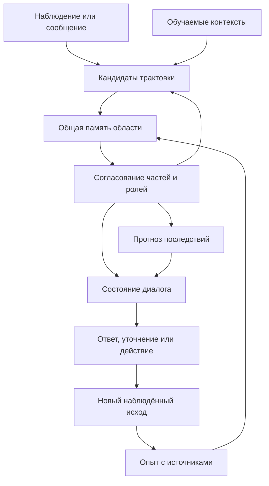

# AI2: от факторной памяти к обучающемуся агенту и чату

Дата: 13 сентября 2026 года. Основание аудита кода — v0.3.0a1,
повторная сверка по коммиту `abafbac4398e46883644657ee68114f8a0f6c999`.
Статус: **пересмотренный проект развития; новые возможности этим документом
не реализованы**. Проект «Сфирот» — отдельная работа и в архитектуру AI2
не входит.

Обновление реализации: [v0.3.0a2](V03_CONTEXT_CHAT.md) добавляет несколько
контекстных результатов, отношения по явному происхождению/утверждениям,
отдельный стенд обучения SDR-отображениям и учебный чат с подтверждаемыми
названиями. Таблицы ниже фиксируют основание предыдущего аудита; полный
объём этапов ими не объявляется выполненным. Новые измерения и ограничения
описаны в документе версии.

Цель AI2 — развивать контекстно-факторную модель, которая учится на опыте,
интерпретирует ситуации, переносит закономерности, действует и объясняется
с человеком. Дорожная карта охватывает и исследовательское ядро, и путь
к собственному языковому диалогу. Она не является гарантированным рецептом
СИИ: несколько центральных переходов ещё требуют разработки алгоритмов
и проверки, а не только программирования известных модулей.

## 1. Что изменилось после повторного анализа

**Узкая общая память в коде уже есть.** В
[`TextFactorModel._select_context`](../src/text_factors/model.py)
все заданные сдвиги сравниваются с одной `self.memory`, а `TransformResult`
сохраняет и выходные биты, и выбранный контекст. Прежнее описание её как
полностью отсутствующей было неточным. Развивать нужно этот механизм:
сейчас он выбирает один глобальный максимум и использует фиксированные
преобразования. Отдельные банки `ExperienceMemory` — другой путь работы
с заданными отображениями, их нельзя смешивать с этим выводом.

**Общая память имеет область действия.** В контекстной схеме преобразования
одной области/уровня обращаются к согласованному опыту. Отсюда не следует
одна глобальная кодировка для зрения, языка и всех уровней описания.
Нужны локальные представления и согласование между ними; указание
контекста нельзя потерять после узнавания.

**Прототип не определяет смысл сам по себе.** В прежнем проекте опорный
пример занял слишком центральное место. Его можно использовать для
сравнения и устойчивого хранения, но содержание понятия связано также
с правилами интерпретации и опытом. Это уточнение следует из технической
части [публикации Редозубова 2021 года](https://habr.com/ru/articles/551644/),
где различаются имя, правила контекста и общая память.

**Факторы — лишь один механизм общей архитектуры.** К ним нужно добавить
обучение контекстам, рекуррентное согласование частей описания, память
событий, модель последствий и языковую композицию. Рост числа кластеров
не заменяет этих переходов.

**Чат имеет собственные этапы.** Интерфейс сообщений можно сделать рано.
Связь слов с опытом, понимание фразы, состояние разговора и построение
верного ответа требуют самостоятельных результатов. Предыдущий
[ручной пример](ARCHITECTURE_WALKTHROUGH.md) проверяет несколько базовых
контрактов, но не описывает весь путь к диалогу.

### Проверка на лишние обязательные решения

Отсутствие детали в источнике не означает, что она запрещена. Следующие
уточнения отделяют положения теории от наших способов реализации.

| Спорное решение или прочтение плана | Оценка соответствия | Решение для AI2 |
|---|---|---|
| Обязательная грамматика `if/copy` и правила в виде программ | Наш отдельный исследовательский вариант; не обязательное устройство контекстной модели | Оставить в ручном стенде; основной путь начать с обучаемых преобразований кодов |
| Обязательный отдельный граф объектов и ролей | Не следует из проверенных работ; требуется сохранять отношения, но формат не предписан | Проверять направление отношений; записи ролей считать адаптером/диагностикой, а не единственным возможным носителем смысла |
| Любой ответ требует `FactorEvidence` | Слишком сильное общее требование: автор рассматривает несколько мер соответствия | Ограничить требование режимом проверки факторного вклада; вид использованного узнавания показывать явно |
| Единый код и память для всей модели | Неподтверждённое расширение принципа общей памяти области | Общность внутри согласованного уровня; локальные коды и контекст сохраняются |
| Выбрать один контекст либо считать все трактовки взаимоисключающими | Для входа с несколькими объектами это теряет содержание | Различать совместимые смыслы, близкие дубли и несовместимые объяснения |
| Отдельный специализированный «разум» языка, мира и диалога | Названия модулей не обосновывают разные механизмы мышления | Разделять программные обязанности; исследовать их реализацию общим контекстным принципом |
| Прототип, журнал, видимость, таймауты и сохранение | Допустимые инструменты реализации, если их не объявлять определением смысла или законом мозга | Сохранить по практической необходимости и с явной областью применения |

Для мер соответствия опора —
[часть 5, «Функция соответствия и условия выбора лучшего контекста»](https://habr.com/ru/articles/309626/):
рассматриваются точное, приближённое, факторное и комбинированное сравнение.
Для нескольких смыслов —
[часть 7, «Коррелированные контексты»](https://habr.com/ru/articles/310960/):
отбор нескольких максимумов с подавлением близких откликов.
Область общей памяти и сохранение контекста уточняются в
[части 8](https://habr.com/ru/articles/312740/) и
[§1.1 совместной работы 2017 года](https://arxiv.org/abs/1712.05954).

## 2. Что действительно дают первоисточники

Проверены наиболее относящиеся к проекту технические публикации. Ниже
отделены описание принципа, конкретный демонстратор и недостающий переход.
Это не утверждение, что просмотрены все видео и все работы автора.

| Источник | Полезное основание | Граница вывода |
|---|---|---|
| [«Логика сознания», часть 5](https://habr.com/ru/articles/309626/), разделы о смысле и семантической информации | Группировка опыта по общим правилам трактовки; неоднозначность слов; влияние предыдущих фраз | Начальная формализация предполагает понятия и пары с трактовками от учителя; полного обучаемого диалогового движка не представлено |
| [Часть 7](https://habr.com/ru/articles/310960/) | Группировка по правилам, обучение для фиксированных контекстов, несколько различающихся максимумов | Один алгоритм получает подробные правила от учителя, другой — известные контексты и пары; совместное открытие всего сразу не показано |
| [Часть 8](https://habr.com/ru/articles/312740/) | Разделение памяти трансформаций и узнавания; согласованное содержание памяти контекстных модулей | Геометрический пример и гипотезы об устройстве коры не доказывают универсальность |
| [Часть 10](https://habr.com/ru/articles/320866/) | Постановка задачи обобщения и работы с составными описаниями | Требования к желаемому обобщению не равны готовому решению языка |
| [Часть 12](https://habr.com/ru/articles/326334/) | Локальные кластеры-гипотезы, их проверка, консолидация и выходной код | Это конкретный вариант механизма; автор допускает его улучшение |
| [Morzhakov и Redozubov, 2017](https://arxiv.org/abs/1712.05954), §1.1 и §2 | Раздельные памяти преобразования и обобщения; узкая реализация контекстного принципа | Используются заданное семейство геометрических преобразований и обычные обучаемые сети; это не демонстратор открытого языка или чата |
| [«Мозг, смысл и конец света», техническая часть](https://habr.com/ru/articles/551644/) | Имя понятия, правила интерпретации, общая память; различение слова и содержания | Технические положения рассматриваются отдельно от последующих аллегорических интерпретаций |

Дополнительно проверены аннотация и библиография работы
[Redozubov и Klepikov, AGI 2020](https://link.springer.com/chapter/10.1007/978-3-030-52152-3_30).
В доступной части поведение связывается с моделированием возможных
ситуаций; полный текст требует доступа и здесь не считается прочитанным.
Найдены также «Формализация смысла»,
[часть 1](https://doi.org/10.18287/2223-9537-2021-11-2-144-153) и
[часть 2](https://doi.org/10.18287/2223-9537-2021-11-3-309-319),
но получить их полный текст в этой проверке не удалось. Выводы о наличии
или отсутствии конкретного алгоритма в этих двух работах не делаются.

В присланных файлах существенны следующие технические места. Строки
относятся к исходным файлам; проверенные хеши приведены в
[NEXT_ARCHITECTURE.md](NEXT_ARCHITECTURE.md). Авторство всех трёх заметок
этим анализом не установлено.

| Фрагмент документов | Что он добавляет к плану | Чего в нём не хватает для реализации |
|---|---|---|
| `пал(1).txt`, 28–33, 514–516, 560 | Различение явления, понятия, имени и преобразования | Схема представления и алгоритм связывания с наблюдениями |
| `пал(1).txt`, 94–96, 235 | Локальный и общий код | Критерий эквивалентности, ошибки кодирования, допустимые потери |
| `гиль(1).txt`, 602, 604, 972 | Параллельные трактовки и их согласование | Обучение преобразованиям, конкуренция и вычислительные границы |
| `Новый текстовый документ(1).txt`, 1179–1181 | Стабильность старого опыта и возникновение нового класса | Метрика новизны и различение нового класса, состояния и представления |
| `Новый текстовый документ(1).txt`, 388 | Разделение накопления событий и отбора гипотез | Протокол replay, политика памяти и пересмотра |
| `пал(1).txt`, 455–459, 472–478 | Прямой прогноз и анализ возможных предшественников | Состояние, действие, неопределённость, многие допустимые причины |
| `пал(1).txt`, 371–378 | Форма слова, его части и разные значения | Рабочая сегментация, морфология и выбор значения |
| `Новый текстовый документ(1).txt`, 2140, 3122; `гиль(1).txt`, 1308 | Согласование внутренних кодов как условие коммуникации | Понимание высказывания, референция, диалоговая память и генерация текста |

Упоминание центра и усреднения в заметках можно использовать как мотив
для устойчивого ориентира сравнения. Оно не отменяет необходимости
контекстной интерпретации. Внутренний «язык кодов» также нельзя автоматически
считать человеческим языком: у чата есть дополнительные задачи композиции,
намерения, ссылок на прошлые реплики и построения ответа.

## 3. Где сейчас находится программа

| Компонент | Фактический статус |
|---|---|
| Разреженное кодирование и локальная факторная память | Работают; есть два варианта консолидации и экспериментальные проверки |
| Преобразование контекста | Обучается по заданным парам; контексты и кодировка предоставлены извне |
| Общая память для фиксированных контекстов | Одна `self.memory` уже оценивает все сдвиги; возвращаются один контекст и его выход. Множественного контекстного результата и обучения неизвестным преобразованиям нет |
| Наблюдения и действия | Есть ограниченный `ExperienceMemory` с полными SDR-парами и отдельными банками отображений |
| Неполные наблюдения, реальные роли, объяснения и рождение операторов | Описаны в проекте, но не реализованы в факторном ядре |
| Планирование | Есть выбор из заданных действий; самостоятельного построения плана нет |
| Язык | Есть обработка символов и окон; значения слов, грамматика, смысл высказывания и генерация ответа не реализованы |
| Диалог и чат | Python API и CLI есть; интерфейса беседы, сессий и диалогового движка нет |
| Сохранение | NPZ сохраняет одну модель; весь банк опыта, будущие знания и разговор вместе не сохраняются |

Названия `ConceptEvidence` или `Entity` в коде не означают, что модель
самостоятельно открыла понятия и объекты. Первое связано с диагностикой
битов и символов, второе имеется в отдельно заданном микромире.

В [измерениях v0.3](V03_RESULTS.md) сложный перенос имеет около 22%
полноты выходных битов и 0% полных совпадений. Простая интеграционная
проверка даёт 12/12 на каждом из трёх повторов другого протокола.
Эти результаты относятся к разным задачам; они не определяют «процент
готовности интеллекта». Новый план не объявляет выявленные ограничения
исправленными.

## 4. Целевая организация ядра

Ниже — наше инженерное предложение по мотивам источников. Названия
компонентов обозначают обязанности, не готовые библиотеки и не набор
независимых механизмов мышления. Они могут использовать одни и те же
операции контекстного преобразования, сравнения и обучения. Таблица
не требует отдельного символического решателя поверх факторного ядра.

| Компонент | Обязанность |
|---|---|
| `ObservationStore` / `EpisodeStore` | Хранить измерения и последовательность действительных событий с источниками и видимостью |
| `ContextTransform` | Преобразовать описание в кандидата трактовки, отметить неизвестные и потерянные части |
| `SharedInterpretationMemory` | Развивать существующее сравнение с общей памятью области; сохранять содержание, контекст и вид основания |
| `ContextLearner` | Учить, различать и при необходимости создавать преобразования по опыту |
| `RecurrentInterpreter` | Согласовывать части, роли, отношения и общий контекст, сохраняя несколько допустимых разборов |
| `WorldModel` / `ActionOperators` | Предсказывать изменение состояния после действия; различать его со сменой вида |
| `LanguageInterface` | Связывать выражения с контекстными представлениями и обратно; исследовать обучение этих преобразований тем же принципом |
| `DialogueManager` | Вести цель беседы, участников, уточнения, исправления и выбор следующего речевого действия |
| `Runtime` | Ограничивать работу, сохранять состояние, обслуживать запросы, отмену и видимый прогресс |

Здесь языковая часть не задаётся отдельной универсальной моделью,
которая сама решает вопросы вместо контекстного ядра. Обучение языковым
преобразованиям нужно разработать и проверить. На ранних ступенях явный парсер и шаблоны
позволят пользоваться системой, но будут отмечены как заданная часть интерфейса.

Общая память не обязана физически храниться в одной копии: можно
использовать общий индекс или согласованные копии. Но одинаковые ID
при несогласованном содержании не создают общей памяти. Отдельные
параметры преобразователей и операторов действий нужны даже при общем опыте.
Это разделение параметров по функциям, а не требование разных видов
обучения. Между областями и уровнями сохраняются собственные коды и
явные связи. Контекстный результат содержит как минимум узнанное
содержание и контекст, в котором оно получено.

Не все несколько трактовок конкурируют. Два узнанных объекта могут
совместно входить в результат; соседние отклики одного узнавания могут
быть дублями; два несовместимых объяснения остаются альтернативами.
Простой список лучших баллов без этих различий не решает задачу.

Рекуррентное согласование также не должно превращаться в бесконечное
самоподтверждение. Каждая итерация имеет бюджет; поддержка берётся из
новых измерений или ранее учтённых оснований, а число реальных событий
от повторения вывода не растёт.

## 5. Все основные этапы развития

Нумерация — порядок зависимостей для проекта. Работа над интерфейсом,
сохранением и ограничением вычислений идёт параллельно. Начинать язык
можно после определения семантических контрактов, не ожидая завершения
универсального планировщика.

| Этап | Что реализовать | Какое новое умение должно проявиться |
|---|---|---|
| 1. Наблюдение и кодирование | Известное/отсутствующее/неизвестное, события, области полноты, версии кодов | Скрытый признак не становится ложным фактом; повторная доставка не повторяет обучение |
| 2. Рабочая факторная память | Проверяемые факторы, полнота покрытия, отбор случайной устойчивости, происхождение выводов | Полезная повторяемая связь переносится при помехах; при нехватке оснований виден отказ |
| 3. Общая память и заданные контексты | Развитие уже имеющегося сравнения: несколько содержательных результатов, учёт близости контекстов, сохранение их ID | Узнаются разные части входа в своих контекстах; близкие дубли не вытесняют вторую часть |
| 4. Обучение контекстам | Порождение кандидатов преобразования, их проверка, организация и ограниченный поиск | Для новой трактовки не требуется вручную выдавать готовую метку и правильный перевод |
| 5. Составная ситуация | Участники, роли, отношения, уровни описания и рекуррентное согласование | Модель различает «A действует на B» и «B действует на A» и переносит связь на новых участников |
| 6. Модель мира и агент | Эпизоды, условия/эффекты операторов, прогноз, различающий опыт, затем планы | По новому результату пересматривается правило; последовательность действий выбирается по ожидаемому последствию |
| 7. Слова и опыт | Единицы переменной длины, формы слов, значения и связь с понятиями/эпизодами | Слово применяется к новому проявлению знакомого содержания, а не только к заученной строке |
| 8. Смысл предложения | Порядок, грамматические роли, отрицание, время, ссылки и несколько разборов | Новая комбинация знакомых слов правильно задаёт участников и отношения |
| 9. Построение ответа | План содержания, выражение его словами, проверка сохранения смысла | Ответ передаёт только поддержанное содержание; формулировка не добавляет несуществующих фактов |
| 10. Диалог | Сессии, цель беседы, активные участники, уточнения, исправления и долговременный контекст | Система понимает продолжение разговора и запрашивает недостающую информацию |
| 11. Знания и инструменты | Чтение материалов, утверждения с источниками, поиск, пересмотр и команды инструментам | Ответ составляется из применимых знаний; результат инструмента изменяет состояние по факту выполнения |
| 12. Дальнейшее обучение и расширение | Перенос между задачами, устойчивое обновление, новые модальности, измерение затрат | Новое обучение не уничтожает проверенные умения; масштабирование подтверждено измерениями |

### Этапы 1–2: подготовить обучаемое основание

Сейчас бинарное ядро принимает полные векторы. Первый практический
вариант — архивировать неполное наблюдение и обучать существующее ядро
только на доказуемо полной локальной области. Полноту устанавливает
датчик или интерфейс данных, а не предположение модели. Для настоящего
обучения с масками придётся отдельно пересмотреть историю и знаменатели
счётчиков. Простое заполнение пропусков нулями недопустимо.

У фактора должны сохраняться область, версия, поддерживающие и
противоречащие события. Нельзя считать один выходной бит постоянным
понятием. Улучшение измеряется по качеству и стоимости полезной функции;
не нужно превращать все старые стенды в бесконечную настройку, но нельзя
маскировать их известные провалы уверенным текстовым ответом.
Редкость признака также не означает бесполезность: отдельно нужны случаи,
где редкий фактор определяет важное последствие.

### Этапы 3–4: развивать контекстное узнавание

Сначала развиваем уже существующую общую память фиксированных сдвигов.
Проверяем несколько смысловых результатов и подавление близких дублей,
сохраняя контекст каждого результата. Для обучения преобразованиям
допустимы заданные виды и реальные пары одного события в разных видах.
Общий код первой области может быть задан разработчиком — это ещё
не открытие системы понятий. Проверяем отсутствие схлопывания разных
объектов, сохранение содержания и перенос на новые сочетания.
Начальные привязки участников также предоставляются интерфейсом парных
наблюдений. Этап 5 развивает их обучаемое и рекуррентное согласование,
а не впервые вводит саму возможность адресовать участника.

Следом ставится более трудная задача: находить семейства преобразований
из опыта и распределять между ними ситуации. Группировать нужно по
совместимости правил преобразования, а не только по сходству исходных
векторов. Близкие преобразования могут помогать ограничивать поиск.
Организация их соседства и обучение самих правил остаются разными задачами.

Критический риск — круг: чтобы учить преобразование, нужно знать,
какие наблюдения соответствуют одному явлению; чтобы узнать явление,
нужно преобразование. Первое решение требует явных исходных опор:
синхронных видов, непрерывности опыта, ограниченного учителя или известной
части преобразований. Утверждать полностью самостоятельное начало
обучения при наличии этих опор нельзя.

### Этапы 5–6: от узнавания к ситуации и действию

Представление должно удерживать участников и направленные связи.
Изменение признака, новый экземпляр, новый класс и новая точка зрения
не должны сводиться к одному порогу новизны. Рекуррентный разбор
согласует локальные кандидаты с общей ситуацией и сохраняет неразрешённые
альтернативы. Неизвестная часть не считается ни совпадением, ни ошибкой.

Операторы учатся по наблюдаемым переходам: условия, роли, изменившиеся
поля и подтверждённые неизменности. Прогноз фиксируется до исхода.
Обратный вопрос может иметь несколько допустимых предшественников.
Действие выбирается по цели и ожидаемому различению гипотез; сначала
проверяется один шаг, затем короткие планы и изменение правил среды.

В первом мире границы объектов и доступные команды можно предоставить.
Конкретные последствия команд и перенос на новые комбинации должна
обучать модель. Для выхода за такую среду потребуется отдельное
обучаемое выделение сущностей из более сырого потока.

### Этапы 7–8: построить связь языка со смыслом

Обработка текста по окнам не задаёт границы смысловых единиц. Нужны
переменная длина, формы слов и устойчивые выражения, а затем связь
с внутренними участниками, отношениями, действиями и опытом.
Одно содержание может выражаться по-разному; одна форма может иметь
несколько значений. Выбор использует ситуацию и предыдущий разговор.

Следующий уровень составляет высказывание. Для него недостаточно набора
слов: важны роли, отрицание, вопрос/утверждение/команда, время и ссылки
на уже введённых участников. Сначала достаточно ограниченного русского
языка одного учебного мира. Явная грамматика пригодна для первого
интерфейса и контроля; способность учить новые языковые конструкции
нужно оценивать отдельно.

Учебные данные — не только сплошной текст, но и пары «ситуация —
высказывание», разные формулировки, различия ролей и исправления.
Тест должен содержать новые сочетания знакомых элементов. После обучения
значениям слов, ролям и отрицанию на других примерах проверяются различия
между «куб толкает шар», «шар толкает куб» и «куб не толкает шар».
Понимание отрицания не предполагается приобретённым из одной положительной
фразы. Тестовые сочетания не должны заранее входить в учебные пары.

### Этапы 9–10: ответ и разговор

Сначала система выбирает, что сообщить: подтверждённый результат,
недостаток данных, альтернативы или уточняющий вопрос. Затем строится
текст. Для первого результата допустимы шаблоны над структурированным
содержанием. Это даст полезный ограниченный чат, но не самостоятельное
овладение естественным языком.

Далее нужен обучаемый путь от содержания к словам с контролем ролей,
отрицания и модальности. Проверка должна ловить случаи, когда внутренне
известно лишь «возможно», а текст сообщает уверенное «произойдёт».
Правильность формулировки и истинность внутреннего вывода оцениваются
раздельно: согласованность двух частей системы не делает общий вывод верным.

Диалог удерживает адресата, упомянутые объекты, цель, ожидаемое уточнение
и текущую версию знания. История сообщений — источник, но не готовое
состояние разговора. После «передвинь его» при двух подходящих объектах
нужен вопрос. После уточнения должно выполняться исходное намерение
с правильным участником, а не начинаться несвязанный новый разговор.

### Этапы 11–12: знания, инструменты и расширение

При чтении документа система должна извлекать утверждения с источником,
временем и областью действия, сохранять противоречия и различать описание
чужих слов, предположение и измеренный факт. Повторение одного текста
не становится независимым подтверждением. Поиск фрагмента полезен,
но сам по себе не подтверждает понимание и перенос его содержания.

Инструменты присоединяются через схему действия: аргументы, ожидаемый
результат, проверяемый фактический исход. План действия и выполнение
разделены, а текст из полученного документа не меняет полномочия системы.
Чат может сначала работать только с локальной учебной средой; реальные
записи во внешние системы добавляются с явной областью разрешённых действий.

Дальнейший рост требует устойчивого обучения новым задачам, работы
с отрицательными случаями, пересмотра старых знаний и контроля затрат.
Зрение и звук добавляются как новые источники наблюдений и преобразований;
сама подача изображения в вектор ещё не обучает его содержанию.
Речь потребует также распознавания и синтеза; подключённые готовые
модули учитываются отдельно от выученных возможностей AI2.

Консолидация, сохранение и контроль забывания нужны с первых шагов,
а не только после этапа 12. Последний этап расширяет их на всё большую
область задач. Возможность обобщения между областями остаётся предметом
проверки, а не автоматическим следствием наличия всех перечисленных модулей.

## 6. Когда появляется чат

| Версия чата | Что пользователь сможет делать | Откуда берётся содержание ответа |
|---|---|---|
| Лабораторная консоль | Передать текст на анализ, посмотреть факторы, состояние обучения и заданное преобразование | Из результатов существующих Python API; команды и подписи заданы разработчиком |
| Диалог учебного мира | Показать ситуацию, назвать объект, спросить о состоянии, запросить действие или объяснение | Из реальных записей среды и выученных связей; сначала с явным разбором ограниченных команд |
| Обучаемый языковой диалог | Использовать новые формулировки, уточнения, отрицания и ссылки на прежние реплики | Из обучаемой интерпретации, состояния беседы, опыта и модели последствий |
| Диалог по накопленным знаниям | Обсуждать прочитанные материалы и новые сочетания фактов, пользоваться инструментами | Из применимых утверждений с источниками, рассуждения и наблюдаемых результатов действий |

Первая версия не требует ждать всех исследовательских этапов. Для неё
уже есть вызываемые функции, но ещё нужны интерфейс, сессии и управление
задачами. Вторая версия становится полезной после минимального связанного
представления мира. Третья не получится из второй одной заменой текстового
окна: требуется обучение языковому разбору и формированию ответа.

Минимальный программный контракт беседы:

| Запись | Содержание |
|---|---|
| `ChatRequest` | Сессия, ID запроса, сообщение, вложения и явно выбранный режим |
| `Observation` | Измеренные поля, полнота области, источник, ID наблюдения и действительного события с его типом |
| `Interpretation` | Кандидаты смысла, намерение, участники/роли, неизвестное и основания разбора |
| `Claim` | Кто что сообщил, о каком времени/мире, источник, статус и противоречия |
| `DialogueState` | Текущая цель, активные участники, неразрешённые ссылки, ожидаемое уточнение |
| `AnswerPlan` | Поддержанное содержание, степень определённости, основания либо вопрос |
| `ChatResponse` | Текст, тип результата и доступные пользователю основания; предложение действия отдельно от факта выполнения |
| `JobStatus` | Фаза, выполненные единицы, причина ожидания, бюджет и итог завершения |

Сообщение «ящик открыт» удостоверяет, что пользователь это сообщил.
Оно не является автоматически измерением физического ящика. В учебном
рассказе оно может задавать состояние описываемого мира; в наблюдаемой
среде — отдельное утверждение для сопоставления с измерениями. Эта область
должна быть явной. Собственные ответы и прогнозы модели не записываются
как новые внешние подтверждения.
Действительное событие может быть сообщением, измерением или действием
среды. Физический переход — частный случай; преобразование представления
или внутренний прогноз сами по себе не создают такого внешнего события.

Для приложения нужны обработка запросов, история, поток статусов, отмена,
ограниченная очередь и снимки состояния. Долгое обучение выполняется
отдельной задачей; беседа использует определённую версию памяти.
Отмена не повторяет уже совершённое действие при повторной доставке.
Механизм восстановления должен сохранять не только кластеры, но и
кодовые книги, эпизоды, журнал доставки, контексты, правила и разговор.

## 7. Один целевой разговор и что за ним должно работать

Это сценарий будущей проверки, не демонстрация нынешней программы.

1. Пользователь показывает сцену и говорит: «Это куб, а это шар».
   Система связывает слова с указанными участниками, фиксируя, какая часть
   обучения предоставлена человеком.
2. Среда показывает несколько взаимодействий и их реальные последствия.
   Модель формирует кандидаты связей; слова сами не сообщают готовую
   физическую функцию мира.
3. Пользователь спрашивает: «Что изменится, если куб толкнёт шар?».
   Разбор должен задать правильные роли и условный характер вопроса.
   Оператор строит прогноз; ответ сохраняет его неизвестные части.
4. Пользователь спрашивает: «А если наоборот?».
   Состояние разговора восстанавливает отношение и меняет роли, сохраняя
   прочие условия. Из памяти выбирается соответствующая область знания.
5. Пользователь говорит: «Передвинь его» при двух возможных референтах.
   Система задаёт уточнение, сохраняет незавершённое намерение и ждёт ответа.
6. После уточнения действие выполняется в среде. Измеренный исход
   записывается один раз и сопоставляется с прежним прогнозом.
7. После сохранения и перезапуска система продолжает разговор с теми же
   знаниями и не засчитывает старый опыт повторно.

Этот сценарий объединяет факторы, смысловые роли, предсказание, язык,
диалог и программный интерфейс. Достоверное прохождение на новых сценах
и формулировках будет конкретным достижением. Один заранее написанный
диалог или совпадение шаблонного ответа таким достижением не является.

## 8. Самые существенные недостающие механизмы

| Пробел | Почему его не закрывает существующий материал/код | Следующее решение, которое нужно проверить |
|---|---|---|
| Смысловое представление | Текущая кодировка AI2 ещё не обеспечивает представление участников, времени, ролей и области утверждения | Обучаемое представление этих связей, в том числе распределёнными кодами; проверяемое происхождение содержания |
| Обучение самому описанию | Обучение при известных парах, контекстах или правилах не решает все неизвестные одновременно | Начальные опоры, язык кандидатов, обучение преобразованию и проверка новым опытом |
| Развитие общей памяти | Текущий общий механизм ограничен фиксированными сдвигами и одним результатом; банки отображений имеют другую задачу | Несколько результатов с контекстами, обучение преобразованиям, согласование областей |
| Мера правдоподобия | Знакомость и частота могут поддержать случайный или малосодержательный ответ | Совпадения, противоречия, полнота, цена сложности и оценка неизвестного по отдельности |
| Композиция и рекуррентность | Упоминание иерархии не определяет привязку ролей и завершение вывода | Алгоритм построения и согласования составного описания с ограничением работы |
| Причина и действие | Ассоциация и эпизодический обратный поиск не устанавливают причинный оператор | Контролируемые изменения, проверка альтернатив и многошаговый прогноз |
| Языковое обучение | Символьный сдвиг не создаёт словарь смыслов, синтаксис и диалог | Учебные пары с ситуациями, новые конструкции и независимый композиционный тест |
| Выбор и выражение ответа | Узнавание входа не задаёт, что именно сказать и какими словами | План ответа, реализация текста и отдельная проверка точности содержания |
| Устойчивое знание | Replay не решает автоматически новые классы, конфликты и забывание | Версии, контрпримеры, пересмотр и измерение сохранения прежних навыков |
| Продуктовая надёжность | Сохранение одной модели не восстанавливает состояние агента и беседы | Полный checkpoint, журнал действий, отмена, очередь и ограниченные задания |

Эти пункты имеют разную природу. Интерфейс, журнал, сохранение и доставка —
инженерные задачи с проверяемыми условиями завершения. Возникновение
представлений, открытие контекстов и перенос языка — исследовательские
задачи: выбранное решение может оказаться недостаточным и потребовать
пересмотра архитектуры. Наличие названия для модуля не является решением.

## 9. Данные и проверка продвижения

Учебную программу следует расширять вместе с архитектурой:

| Ступень данных | Что варьируем | Что оставляем неизвестным при проверке |
|---|---|---|
| Простые составные сигналы | Совместность, шум, редкие значимые признаки, маски | Какие факторы заданы оценщиком |
| Парные виды | Представление при общем содержании, идентичности и помехи | Новые сочетания и часть преобразований |
| События и действия | Участники, роли, условия, правила среды | Конкретный закон и полезное действие |
| Ситуации и высказывания | Формы слов, порядок, отрицание, тема, несколько значений | Новые сочетания известных понятий и фраз |
| Разговоры и документы | Уточнения, исправления, источники, временные изменения | Новые вопросы и комбинации знаний |

Для каждого навыка отдельно записываются: какая структура дана
разработчиком, что модель выучила, сколько разных событий получила,
какие данные использованы для выбора настроек и где проверен перенос.
Если факторный слой отключён, а система выдаёт прежние ответы благодаря
готовому решателю, такой опыт не доказывает пользу факторного ядра.

Нужны содержательные контрольные условия, а не соревнование числа
пройденных программных тестов: неоднозначность, отсутствие ответа,
перестановка ролей, противоречие, новая композиция и смена правила.
Качество отдельных битов, правильность состояния, успех действия,
сохранение смысла фразы и поведение диалога измеряются раздельно.

Эта программа не требует сейчас перезапускать все длинные эксперименты.
Для следующего среза достаточно заранее выбранных небольших проверок,
которые выявляют конкретный риск. Просмотренные примеры нельзя затем
называть независимым подтверждением улучшения.

## 10. Ближайшие реализации и видимый результат

| Очерёдность | Конкретная поставка | Что станет доступно |
|---|---|---|
| A. Наблюдение и общий опыт | Записи измерений/утверждений, области полноты, роли и журнал доставки | Можно честно хранить неполный опыт и отслеживать происхождение знания |
| B. Контекстный срез | Расширение текущего сравнения с одной памятью: несколько результатов с контекстами, затем обучение преобразованиям | Опыт используется при разных трактовках, без потери второй узнаваемой части |
| C. Первая чат-консоль | Сессии, команды анализа и просмотра мира, шаблонные ответы, статусы и отмена | Проектом можно пользоваться в окне разговора и наблюдать реальную работу ядра |
| D. Первое обучение языковой связи | Названия объектов и отношений, ограниченные фразы, новые роли и сочетания | Чат начинает задавать содержательные вопросы к собственной памяти |
| E. Расширение по главной дорожной карте | Контексты из опыта, операторы, рекуррентный разбор, генерация и диалог | Каждый следующий навык проверяется отдельно и включается в интерфейс |

Работы A и C частично независимы. D можно начинать после фиксации
содержания и ролей, не дожидаясь универсального E. Готовая первая
чат-консоль не считается завершением языкового этапа.
Для проверки соответствия теории приоритет B — развитие существующего
контекстного механизма. Полный граф сущностей и генератор программ
`if/copy` не являются условиями начала этой работы.

Для каждого запуска выводится фаза, число обработанных единиц, причина
ожидания и оставшийся бюджет. При известном конечном объёме можно оценить
остаток по измеренной скорости. Если поиск порождает новые гипотезы,
показывается бюджет и достигнутый результат, а не выдуманный процент.
Долгие задания получают внешнее ограничение времени и контрольные записи.

Python остаётся языком исследовательского проекта. Оптимизация начинается
с измерения расхода CPU и полной памяти процесса; самые затратные операции
можно переносить в более эффективное исполнение после установления их
полезности. Ограничение размера одного кластера не гарантирует малую
суммарную память всех контекстов и эпизодов.

Из документов нельзя вычислить срок создания СИИ, гарантированный объём
обучающих данных или достаточность одного компьютера для будущей общей
модели. Небольшой локальный чат и обучаемый агент ограниченной среды —
конкретные промежуточные цели. Сравнение с GPT имеет смысл позже на
одинаковых задачах, данных, времени и ресурсах, когда появятся сравнимые
возможности.
