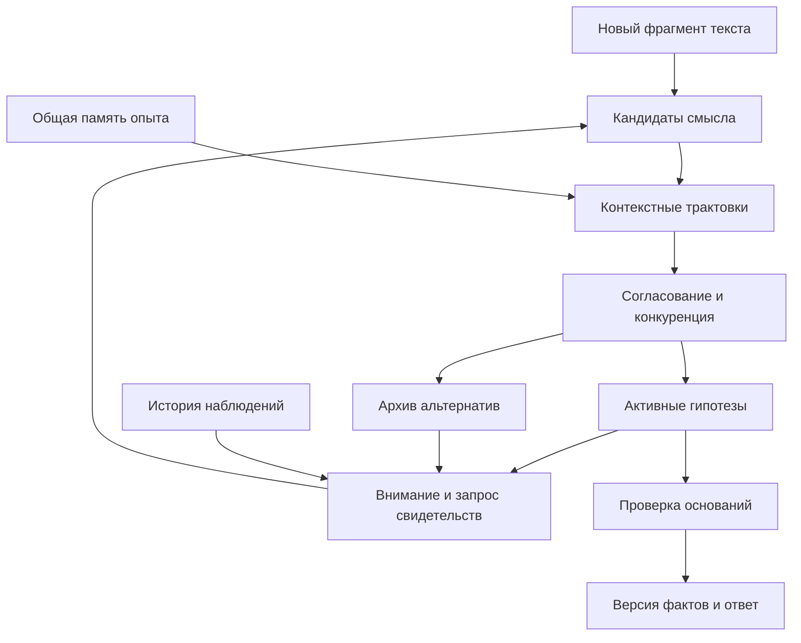

# AI2: согласование гипотез, внимание и пересмотр смысла

Дата: 20 сентября 2026 года. Основание аудита: AI2 v0.5.0a1,
опубликованный [снимок `19eb066`](https://github.com/anatolahnov5317-hash/AI2/tree/19eb06615e84628d92d212d2f59fd1afd31f68ae).
Содержимое локальных отслеживаемых файлов сверено с этим снимком.

Это отчёт по исходникам и первоисточникам и проект дальнейшей архитектуры.
В рамках этой работы код, тесты, веса и проверочные наборы не изменялись;
обучение и новые испытания не запускались. Численные результаты ниже взяты
из уже сохранённого [отчёта v0.5](V05_RESULTS.md).

## 1. Ответ на главный вопрос

**Описанный в сообщении механизм целиком не реализован.** Есть полезные
части: несколько контекстных представлений, сопоставление с общей факторной
памятью, обучение близости контекстов, выделение отдельных содержаний,
сохранение событий и отмена утверждений. Однако они пока не образуют
единого процесса, который хранит конкурирующие смыслы, согласует их при
поступлении каждого слова и возвращает ранее подавленные трактовки.

В работающем `learned-chat` языковой модуль сначала выбирает одну структуру
смысла. Только после этого выбранное событие проверяется ядром. Сохранённый
контекст влияет на разбор ограниченно; отдельного поиска по истории
отвергнутых смыслов нет. Поэтому позднее уточнение не может автоматически
вернуть прежнюю альтернативу и пересобрать зависимые от неё выводы.

**Голов внимания в этом тракте сейчас нет.** Названные ранее семантическими
головами компоненты — линейные классификаторы предиката, отрицания, времени
и других признаков. Они обучаемые, но это иной механизм.

Правильная цель следующей переработки: сделать альтернативные трактовки
сохраняемыми объектами вычисления и дать общей памяти участвовать в выборе
между ними **до** фиксации фактов. Внимание должно управлять поиском нужных
свидетельств и повторным рассмотрением альтернатив. Само по себе увеличение
числа голов или размера окна контекста эту задачу не решит.

## 2. Что действительно следует из источников

Присланный фрагмент задаёт желаемое поведение. Для реализации полезно
разделить его на узнавание в контекстах, согласование трактовок и пересмотр
во времени. Формулы и компоненты дальнейших разделов — предлагаемые решения
для AI2; они не выдаются за опубликованный Редозубовым готовый алгоритм чата.

| Источник | Существенное для проекта положение | Граница вывода |
| --- | --- | --- |
| [Редозубов, часть 5](https://habr.com/ru/articles/309626/) | Исходное описание преобразуется в разных контекстах; трактовки сопоставляются с опытом. Предыдущий контекст повествования влияет на последующую интерпретацию. | Это основание для контекстной обработки; конкретный контроллер внимания AI2 из него ещё не получается. |
| [Редозубов, часть 7](https://habr.com/ru/articles/310960/) | Контексты можно формировать по согласованным правилам преобразования. При узнавании нужны локальные максимумы с учётом близости контекстов. После выбора максимума подавляется его коррелированное окружение, затем поиск продолжается. | Выбор одного глобального победителя потерял бы другие содержания. Алгоритм не равен голосованию по числу голов. |
| [Редозубов, часть 8](https://habr.com/ru/articles/312740/) | Разделены преобразование описания и сравнение с опытом. Разные контекстные модули должны иметь доступ к согласованному содержанию памяти; различные допустимые трактовки сохраняются. | Предположения о миниколонках и пространственной организации коры не являются доказанным устройством нашего программного механизма. |
| [«Формализация смысла», часть 2, 2021](https://www.ontology-of-designing.ru/article/2021_3%2841%29/Ontology_Of_Designing_3_2021_4_A.D.Redozubov_309-319.pdf) | Контекст объединяет преобразование, память и сравнение. Набор найденных потенциальных смыслов ещё требует дальнейшей обработки с учётом ограничений. | Статья не задаёт полностью обучение языку, архив отвергнутых разборов, контроллер внимания и процедуру пересмотра длинного диалога. |

Отсюда существенная поправка к буквальному прочтению «самой широкой»
гипотезы. Несколько контекстов могут обнаруживать разные части одной сцены,
а несколько близких контекстов — почти одинаково обнаруживать одну часть.
В первом случае смыслы следует сохранить совместно. Во втором повторение
почти одинакового обнаружения не должно искусственно увеличивать уверенность.

Таким образом, потребуются **два разных уровня отбора**: выделение содержаний
в пространстве контекстов и согласование более крупных объяснений ситуации.
Нельзя подменить второй уровень первым или объявить все соседние отклики
независимыми голосами за одно объяснение.

## 3. Что уже есть в AI2 и где проходит граница

Пути в таблице относятся к указанному коммиту. Названия функций позволяют
проверить выводы непосредственно в коде.

| Механизм | Реализовано | Чего это пока не даёт |
| --- | --- | --- |
| Несколько контекстных представлений | [`recognition.py`](../src/text_factors/recognition.py), `recognize_views`: представления, переданные вызывающим кодом, читают одну факторную память; сохраняются несколько кандидатов. | Представления не возникают сами как альтернативные разборы произвольной фразы. Поддержка разных представлений не собирается в согласованную гипотезу рассказа. |
| Обученные преобразования | [`context_pipeline.py`](../src/text_factors/context_pipeline.py), `LearnedContextPipeline`: банк преобразований и последующее чтение общей памяти. | Каталог преобразований задан вызывающей стороной. Этот pipeline не является трактом `LearnedSession`. |
| Несколько содержаний в сцене | [`scene_recognition.py`](../src/text_factors/scene_recognition.py), `FactorSceneReader`: факторные портреты, покрытие, перекрытия и необъяснённый остаток. | Перекрытие свидетельств отмечается как неоднозначность; оно не разрешается общим согласованием смыслов. |
| Близость контекстов | [`context_affinity.py`](../src/text_factors/context_affinity.py), `ContextAffinity` и `AdaptiveContextAffinity`: статистика совместных и односторонних откликов, отбор близких избыточных кандидатов. | Это ограниченная близость узнавания, а не семантическое согласие и не управление вниманием. В `learned-chat` эти селекторы не подключены. |
| Дубли и противоречия | [`recognition.py`](../src/text_factors/recognition.py), `relate_candidates`: сравнение происхождения, факторных свидетельств и явно переданных утверждений. | Противоречия задаются через поля утверждений. Текущий отбор подавляет дубли, но не моделирует динамику взаимного торможения смыслов. |
| Общий опыт в обучаемом диалоге | [`learning/dynamics.py`](../src/text_factors/learning/dynamics.py), `_compatibility`: исходная ролевая структура и перестановка действующего лица/получателя проверяются в одном банке опыта. | Возвращаемая итоговая поддержка берётся только из исходного представления. Второе представление диагностическое; это не коллективный выбор между трактовками текста. |
| Возможность оценить альтернативы | Там же, `score_interpretations`: можно подать до восьми событий. | В рабочем пути диалога метод не вызывается. Наличие API не означает наличие механизма в чате. |
| Обучаемое понимание | [`learning/understanding.py`](../src/text_factors/learning/understanding.py), `interpret`, `_best`, `_reference`: предсказание признаков, ролей и референта с порогами отказа. | На выходе одно `Meaning` или отказ. Возможные полные альтернативы не сохраняются. |
| Поле альтернатив | [`learning/schema.py`](../src/text_factors/learning/schema.py), `Interpretation.alternatives`: формат допускает до восьми смыслов. | Парсер это поле не наполняет. В формате нет жизненного цикла гипотезы, её отдельных оснований, подавления и возврата. |
| Контекст диалога | [`learning/session.py`](../src/text_factors/learning/session.py), `_advance_context`: до 16 текстов, 64 сущностей и 16 имён в фокусе. | Языковые признаки непосредственно используют только последний предыдущий текст, а референция — ограниченные признаки сущностей и недавности. Это не внимание по всей истории. |
| История фактов и исправления | [`learning/world.py`](../src/text_factors/learning/world.py): журнал событий, источники, исправления, отмена и проекция состояния. | Хранятся выбранные интерпретации. Отмена по новой команде не равна автоматическому пересмотру старого разбора из-за позднего контекста. |
| Консолидация и повтор опыта | [`consolidation.py`](../src/text_factors/consolidation.py), [`memory.py`](../src/text_factors/memory.py): локальное обучение и консолидация кластеров. | Это не архив подавленных значений фразы. В динамике v0.5 используется частотный режим; включение `coactivation` само по себе внимания не создаст. |
| Выбор действия и генерация | [`learning/dialogue_learning.py`](../src/text_factors/learning/dialogue_learning.py): обученная политика и поиск последовательности выходных токенов. | Политика не управляет извлечением старых гипотез. Поиск вариантов ответа начинается после выбора смысла и не заменяет поиск трактовок входа. |

Фактическое место разрыва находится в `LearnedSession.respond`:
вызов `understanding.interpret` → получение единственного `meaning` →
`dynamics.predict` для одного события → изменение предполагаемого мира.
Сведения об альтернативах используются для диагностики или уточнения,
но не для повторного смыслового выбора.

Есть и два менее очевидных ограничения интеграции.

Во-первых, результат `FactorSceneReader.recognize_views` сейчас не содержит
полного набора `ContextResponse`, который ожидает адаптивная карта близости.
При этом динамика передаёт пустое происхождение и не передаёт смысловые
утверждения контекстных представлений. Поэтому соединить эти классы одним
вызовом недостаточно: сначала нужен общий контракт свидетельств.

Во-вторых, перестановка участников иногда даёт тот же SDR: структурные
признаки динамики не содержат сами имена, а при отсутствии различающего
предшествующего состояния перестановка не меняет код. Два таких ответа
нельзя считать двумя независимыми подтверждениями.

## 4. Почему недостаточно просто добавить внимание

Стандартное attention сопоставляет запрос с ключами и вычисляет взвешенное
представление значений. В multi-head attention несколько обучаемых проекций
выполняют это параллельно. Такой оператор полезен для извлечения информации,
но сам не определяет, какие гипотезы логически несовместимы, какой факт
устарел и можно ли записать вывод в память.
[Vaswani et al., Attention Is All You Need](https://arxiv.org/html/1706.03762v7).

Следовательно, голова внимания не обязана быть отдельной точкой зрения,
голосом за гипотезу или аналогом миниколонки. Две головы могут читать одно
место и воспроизводить одно основание. Большой вес attention показывает
выбор информации данным вычислением, а не истинность утверждения.

Для AI2 нужны три самостоятельные функции:

1. **Предложение трактовок:** какие смыслы допускает текущий фрагмент.
2. **Контекстное узнавание и согласование:** насколько эти смыслы поддержаны
   опытом и совместимы со свидетельствами.
3. **Внимание:** что ещё извлечь и пересмотреть, чтобы уточнить выбор.

Ни одна из них не должна молча подменять остальные. Увеличение числа
классификаторов признаков не создаст третью функцию. Добавление attention
к генератору ответа не исправит первую.

## 5. Предлагаемая архитектура

Предлагается сохранить факторное ядро для контекстного узнавания и обученных
преобразований. Перед фиксацией фактов добавить работу с несколькими
связанными трактовками, а вокруг неё — извлечение эпизодов и пересмотр.
Это конкретная инженерная гипотеза, требующая последующей проверки.

На схеме обратная связь — необходимая часть. Возвращённый эпизод может
изменить кандидатов, а изменение трактовки — потребовать пересчёта прежних
фактов. Без этих путей получится только более сложный однократный выбор.

### Раздельно хранить наблюдение, гипотезу и принятый вывод

| Объект | Что хранит | Правило изменения |
| --- | --- | --- |
| Наблюдение | Исходный текст, источник, порядок поступления, границы слов/фраз, доступные внешние события. | Исходное сообщение сохраняется неизменным; исправление пользователя — новое сообщение. |
| Гипотеза | Структуру смысла, контекст трактовки, связи с наблюдениями и другими гипотезами, оценки и предполагаемые последствия. | Можно уточнять, подавлять, возвращать и заменять новой версией. |
| Принятый вывод | Факт или ответ с явными основаниями, областью действия и версией интерпретации. | Пересматривается через журнал изменений и пересчёт зависимостей. |

Даже хорошо поддержанная гипотеза о намерениях персонажа не становится
наблюдением. Аналогично пользовательское «он обещал» не превращается в факт
исполнения обещания. Эта граница должна сохраняться во всём новом механизме.

### Что должно быть в записи гипотезы

Нужны устойчивый ID и версия; опорные участки текста; структура участников,
отношений и событий; время, отрицание, модальность и источник; контекст
преобразования; ссылки на поддерживающие и противоречащие свидетельства;
зависимости; локальная оценка; оценка согласованности с историей; состояние
активности; причина подавления; предполагаемые изменения мира.

Статусы должны различать хотя бы активный вариант, временно подавленный,
опровергнутый доступными свидетельствами и структурно недопустимый.
Недостаток вычислительного бюджета — ещё одна отдельная причина неполноты.
Нельзя записывать «опровергнуто», если вариант просто не успели рассмотреть.

Для длинной истории важен не только текущий набор кандидатов, но и связи
их происхождения. Предпочтительна общая структура с разделяемыми фрагментами:
альтернативы хранят отличающиеся участки и изменения мира, а не полную копию
всего разговора каждая. Это ограничивает рост памяти.

## 6. Как получать гипотезы до преждевременного выбора

Первый необходимый шаг — отказаться от независимого необратимого `argmax`
по каждому признаку. Несколько правдоподобных значений ролей, времени и
области действия должны собираться в **совместимые полные или частичные
структуры**, которые можно предъявить опыту.

Нельзя брать все сочетания верхних меток: их число быстро растёт,
а лучшие отдельные метки могут образовать плохое совместное дерево.
Нужен ограниченный поиск, в котором каждое расширение сохраняет ссылки
на слова и проверяет допустимость ролей, границ и вложенности.

Для незавершённой фразы частичная структура является нормальным результатом.
После «Маша передала» получатель и предмет могут ещё отсутствовать;
это повод ждать продолжения, а не угадывать участников или объявлять
весь префикс неизвестным.

Для следующей версии целесообразен небольшой обучаемый последовательный
кодировщик с представлениями позиций и контекстным чтением памяти. Он должен
выдавать кандидатов связей и структур, а не только метки всей фразы.
Компактный рекуррентный кодировщик с вниманием к сохранённым позициям —
разумный начальный вариант для ограниченного мира; небольшой причинный
attention-кодировщик — альтернатива для сравнения. Ни один из них не следует
объявлять необходимым биологическим механизмом Редозубова.

Обучаемыми должны быть связи между словами, ролями и контекстом, а не
список готовых строк. При этом технические ограничения формата и допустимые
структуры остаются явными и раскрываются в документации.

Конечную таблицу имён и словоформ также придётся переработать: разрешить
ввод новой сущности из наблюдения, учить связывание её упоминаний и сохранять
неуверенность в типе или роли. Буквенное или подсловное представление поможет
представить незнакомую форму, но само по себе не сообщит значение нового слова.

## 7. Как измерять «ширину» поддержки

**Ширина должна означать разнообразную согласованную опору, а не количество
копий одного мнения.** При этом знакомость, ширина и истинность — разные
характеристики. Часто встречавшееся неверное объяснение не становится верным
от количества повторений.

Каждый ответ контекстного модуля должен возвращать не один балл, а запись:
какая гипотеза проверена; какое преобразование применено; что обнаружено
в общей памяти; какие фрагменты объяснены; какие не объяснены; есть ли
противоречие; на какие исходные наблюдения опирается результат; полностью
ли завершена проверка.

Один и тот же исходный эпизод получает один идентификатор происхождения.
Повторное извлечение, другая голова и новый проход согласования не создают
нового эпизода. Отличные идентификаторы записей также не гарантируют разных
оснований: пересказ и его источник могут описывать одно событие.

Для точных дублей можно использовать простой инвариант: внутри группы
одинаковых свидетельств учитывается максимальная поддержка, а не их сумма.
Тогда клонирование головы с тем же входом и результатом не изменяет балл.
Для частично зависимых свидетельств нужны отдельная оценка зависимости
и ограничение вклада; произвольная кластеризация не доказывает независимости.

Возможная инженерная функция ранжирования:

$$
S_t(h)=L_t(h)+\alpha B_t(h)+\beta H_t(h)
       -\gamma C_t(h)-\delta A_t(h).
$$

Здесь `L` — соответствие доступному тексту, `B` — поддержка после учёта
повторов и зависимости свидетельств, `H` — согласованность с историей,
`C` — противоречия в правильной области действия, `A` — неподтверждённые
допущения. Это **предлагаемая схема признаков для обучаемого ранжирования**,
а не формула из статьи и не откалиброванная вероятность. Веса требуется
учить на отделённых данных разработки. Жёсткая логическая несовместимость
не должна исчезать из-за большого положительного балла других слагаемых.

Единый учёт происхождения нужен **между всеми слагаемыми `L`, `B`, `H`,
оценками противоречий и сообщениями между гипотезами**, а не только внутри
одного компонента. Если одна реплика дала языковой балл, запись в памяти
и затем историческую поддержку, это не три независимых подтверждения.
Такие оценки можно использовать как разные признаки одного основания,
но нельзя складывать как независимые свидетельства. Нужен общий журнал
оснований либо совместная оценка факторов с явными зависимостями;
обучение ранжировщика само по себе не гарантирует устранения двойного счёта.
Предпочтительна малая проверяемая схема учёта, а не произвольное суммирование
десятков похожих баллов.

Для исходных контекстных трактовок сохраняется общий банк опыта одной
версии. Если внимание предварительно выбирает фрагменты банка, кандидаты
сравниваются на согласованном объединении извлечённых свидетельств;
неполнота поиска видна в результате. Иначе любимой гипотезе можно незаметно
дать удобную память, а её сопернику — другую и менее подходящую.

## 8. Какие отношения нужны между гипотезами

| Отношение | Пример смысла отношения | Действие |
| --- | --- | --- |
| Дублирование | Два почти одинаковых обнаружения с тем же происхождением. | Объединить учёт основания; сохранить представителей и происхождение. |
| Поддержка | Один проверенный результат увеличивает правдоподобие другого. | Передать свидетельство с его происхождением, не создавать новый факт подтверждения. |
| Несовместимость | Два значения одной однозначной роли в одном событии, времени и области действия. | Развести альтернативные ветви и уменьшать их совместную допустимость. |
| Сосуществование | Разные объекты, времена или аспекты ситуации. | Сохранить оба; отсутствие конфликта не считать доказательством взаимной поддержки. |
| Зависимость | Вывод использовал трактовку местоимения или более ранний факт. | При пересмотре основания пересчитать зависимый вывод. |

Сходство контекстов, взаимная поддержка и противоречие должны храниться
раздельно. Из сходства A с B и B с C не следует тождество A и C.
Объединение всего связного компонента графа близости может уничтожить
различные смыслы.

Время, говорящий, цитирование, предположение и воображаемая ситуация входят
в область действия противоречия. «Книга была в ящике» и «книга теперь у Пети»
могут образовывать последовательность. «Петя считает, что книга в ящике»
может сосуществовать с другим фактическим местом книги.

Буквальный слой рассказа и его переносное прочтение также не обязаны
исключать друг друга. Конкуренция должна разрешать конкретную неопределённость,
а не уничтожать все другие уровни описания.

Одинаковое название предмета также не означает одного экземпляра: две книги
могут иметь одинаковые признаки, но разные события появления и владельцев.
Происхождение и идентичность экземпляра нужны до подавления дублей, иначе
система «согласует» разные предметы в один.

## 9. Как устроить согласование без самоподтверждения

В пределах очередного шага обработки можно выполнить несколько ограниченных
обменов сообщениями по графу гипотез. Узлы получают обновлённые основания,
учитывают совместимость и пересчитывают активность. Для управляемости нужны
синхронные раунды, демпфирование изменений, ограничение числа раундов и
остановка при малом изменении оценок.

Не следует объявлять такие вычисления физической интерференцией волн.
В предлагаемом программном варианте это явная конкуренция и обмен
свидетельствами. Для настоящего волнового механизма понадобились бы другие
формальные переменные и отдельное обоснование.

При цикле «A поддерживает B, B поддерживает A» одна исходная улика не должна
превратиться в две. Сообщение переносит ссылки на основания; повторное
приходящее основание не увеличивает их число. Изменение активности само
по себе также не записывается в память как подтверждённый опыт.

Выход согласования — несколько совместимых активных гипотез по разным
аспектам ситуации, альтернативы для нерешённых вопросов и оценка полноты
рассмотрения. При близких оценках сохраняется неопределённость. Ограниченная
процедура не гарантирует нахождения глобального оптимума.

«Победитель» означает лучший текущий рабочий вариант для данного вопроса.
Это не лицензия немедленно объявить весь его смысл истинным или записать
все его предполагаемые последствия как совершившиеся события.

## 10. Какие головы внимания нужны и как их обучать

Предлагается разделить источники чтения памяти. Это функциональные каналы,
а не обещание, что каждая физическая attention-голова сама приобретёт
однозначную человеческую специализацию.

| Канал внимания | Запрос | Что читает | Что возвращает |
| --- | --- | --- | --- |
| Текущая фраза | Какая связь или роль пока не разрешена? | Доступный префикс текста и позиции упоминаний. | Опорные участки для построения кандидатов. |
| История эпизодов | Что относится к этой сущности, событию и времени? | Исходные сообщения и версии их трактовок. | Эпизоды с источниками и временными связями. |
| Подавленные альтернативы | Какой прежний вариант может объяснить новое затруднение? | Архив гипотез и причины их подавления. | Кандидаты для повторной проверки. |
| Проверка возражений | Что могло бы опровергнуть текущего фаворита? | Неразрешённые противоречия, остатки и контрсвидетельства. | Основания для ослабления или уточнения гипотезы. |

Запрос должен зависеть не только от последнего слова, но и от нерешённой
задачи: отсутствующей роли, нового противоречия, неожиданного продолжения
или вопроса пользователя. Ключи памяти включают содержание, сущности,
временную область и тип источника. Значения сохраняют исходные записи
и их идентификаторы.

Внутренние векторы можно смешивать для вычисления запроса. Однако взвешенное
среднее записей «книга у Маши» и «книга у Пети» нельзя превратить в новый
факт. На выходе поиска необходимо сохранять раздельные структурные
свидетельства и альтернативные миры.

Полезен двухступенчатый доступ: быстрый индекс предлагает небольшой список,
обучаемое внимание уточняет выбор; затем контекстные преобразования и ядро
проверяют трактовки. Возврат списка релевантных записей ещё не означает
подтверждение гипотезы их содержимым.

Сначала каналы можно ограничить по типам доступных записей и учить на
явно размеченных опорах. Затем распределение чтений следует обучать
по качеству разрешения неопределённости. Нужны случаи, в которых полезная
опора находится далеко, свежая запись вводит в заблуждение, старый кандидат
оказался правильным, а прежний фаворит всё же оказался верным.

Следует проверять разнообразие **используемых оснований**, а не только
различие матриц весов голов. Вспомогательные ограничения и отключение
отдельных каналов при обучении могут снизить их дублирование, но не дают
математической гарантии независимости. Универсальное правильное число
голов из теории не следует; его выбирают после проверки пользы каждого
канала и затрат вычисления.

Внимание к внешней памяти с несколькими шагами чтения имеет самостоятельные
исследовательские прецеденты, например
[End-To-End Memory Networks](https://arxiv.org/abs/1503.08895).
Это полезный технический ориентир, но не тождество с моделью Редозубова
и не подтверждение предлагаемой здесь архитектуры.

## 11. Как возвращать отвергнутые смыслы

Временное подавление должно означать снижение текущей активности, а не
стирание записи. Нужно сохранить, **почему** вариант проиграл: не хватало
местного контекста, конкурирующий референт был вероятнее, существовало
конкретное противоречие или просто закончился бюджет.

Позднее слово или эпизод может изменить именно это основание. Например,
уточнение участника делает прежнюю привязку местоимения несостоятельной.
Контроллер находит зависевшие от неё кандидаты, возвращает альтернативы
в активное рассмотрение и проверяет их на обновлённом наборе свидетельств.

Возврат не должен быть привилегией проигравшей гипотезы. Она получает
возможность новой проверки, а не дополнительные баллы за сам факт подавления.
Раньше отвергнутое может оказаться и по-прежнему ошибочным.

Архив ограничен. Поэтому нужны два пути восстановления: чтение сохранённой
альтернативы и повторное построение кандидатов по исходному фрагменту с новым
контекстом. Если были удалены и кандидат, и необходимые исходные наблюдения,
корректного восстановления гарантировать нельзя. Одна краткая сводка
победившей трактовки может не содержать нужной двусмысленности.

Текущие `RecognitionResult.suppressed` для этого недостаточны: они являются
следом отбора, а селекторы не возвращают их в конкуренцию автоматически.
Часть кандидатов, потерянных из-за лимита количества, вообще не попадает
в этот след.

## 12. Согласование при каждом слове и по всей истории

Нужны два масштаба состояния. Локальный хранит варианты текущей фразы;
повествовательный — версии событий, связи между ними и более длительные
объяснения. Новый локальный результат изменяет историю, а история влияет
на очередной локальный выбор.

Каждый такт получает ID и неизменяемый снимок: доступный префикс,
версии мира и интерпретаций, банка памяти и параметров модели. Все
сравниваемые оценки строятся по этому снимку. Приход нового слова или
фиксация пересмотра создаёт следующий такт; запоздавший результат
предыдущего нельзя смешивать с текущими оценками — его отклоняют либо
пересчитывают. Одинаковой версии банка памяти недостаточно, если модули
видели разные префиксы или разные состояния мира.

На каждом новом слове выполняется ограниченный такт:

1. Добавить наблюдаемый префикс и обновить частичные структуры.
2. Определить, какие зависимости и оценки действительно изменились.
3. Извлечь необходимые эпизоды и прежние альтернативы.
4. Проверить новые или изменившиеся контекстные трактовки общей памятью.
5. Учесть повторяющиеся основания, совместимость и противоречия.
6. Обновить активные и подавленные варианты и сохранить неопределённость.

Это проект обработки префикса. Для такого режима обучающие входы не должны
содержать ещё не полученные слова. Полная фраза может служить источником
поздней разметки и пересмотра, но не подсказкой раннему решению. Если
используются подслова, отдельно определяется момент завершения слова и
границы смыслового такта.

Фраза «за один проход» требует уточнения реализации: один внешний такт
ввода может содержать несколько коротких внутренних раундов согласования.
Обещать, что один прямой проход произвольной сети разрешит все циклические
противоречия, оснований нет. Число раундов и неполнота должны быть явными.

В долгой истории нельзя каждый раз заново прибавлять всю прошлую поддержку.
Счёт обновляется по новым независимым основаниям и пересмотренным связям.
При этом старую информацию нельзя просто обесценивать с возрастом:
давняя причина события может быть ключевой. Старение полезно для приоритета
поиска; оно не должно автоматически делать подтверждённое основание ложным.

Нужен и механизм смены темы. Длительная поддержка прежнего контекста не
должна запрещать новому ясному эпизоду изменить ситуацию. Полезно различать
продолжение одной истории, новый эпизод и сообщение об изменении состояния.
Точные границы и веса переключения следует обучать, а не задавать правилом
«старый контекст всегда сильнее» или «последнее слово всегда важнее».

Текущий `Meaning` для развитого повествования недостаточен: в дальнейшем
понадобятся связи между событиями, время события отдельно от времени
сообщения, содержание чужих убеждений, цели и причинные предположения.
Роли и отношения должны быть представлены до того, как внимание сможет
выбирать между соответствующими смыслами.

### Пример требуемого поведения

Следующий пример иллюстрирует будущий механизм, а не возможности нынешнего
словаря AI2. Разговор шёл об архитектуре крепостей. Затем поступает:
«Он рассматривал замок. В его скважине застрял ключ».

| Момент | Состояние гипотез | Работа внимания и согласования |
| --- | --- | --- |
| Получено слово «замок» | Доступны значения сооружения и запирающего устройства. Предшествующая тема может поддерживать первое. | Сохранить оба смысла с одним исходным словом, но разными трактовками. Если первое лидирует, второе остаётся доступным. |
| Получена связь «в его скважине» | Возникает затруднение у трактовки сооружения. | Вернуться к исходному упоминанию и извлечь альтернативу устройства; проверить связь нового местоимения и характерные отношения в опыте. |
| Получено продолжение «застрял ключ» | Совокупность отношений сильнее поддерживает устройство в обычном буквальном прочтении. | Пересчитать конкретное упоминание и зависимые выводы. Не считать повторные чтения этих слов дополнительными уликами. |
| Подготовка ответа | У слова в данном фрагменте выбрано новое прочтение. | Объяснить его последующим описанием. При этом тема архитектуры и существование крепости не обязаны исчезать из истории. |

Этот пример показывает, почему одной длительности доминирования контекста
недостаточно. Если восемь голов повторяют вывод из темы «архитектура», это
по-прежнему одно основание; оно не должно заглушить новую конкретную связь.
Обратная ситуация тоже возможна: серия разнесённых по истории независимых
свидетельств поддерживает более общее объяснение, которое казалось слабым
в каждом отдельном фрагменте. Меняться должен его суммарный обоснованный
рейтинг, а не исторический текст и не число искусственных повторов.

## 13. Как пересматривать память, сохраняя основания

Позднее свидетельство должно порождать новую версию трактовки старого
фрагмента. После этого пересчитываются зависимые следствия, а исходный текст
и прежняя версия остаются доступны для объяснения изменения.

Для реализации нужен менеджер пересмотра. Он находит затронутую ветвь
зависимостей, строит изменения в отдельном состоянии, проверяет области
действия и фиксирует новую проекцию атомарно. Остальные независимые факты
при этом сохраняются. При превышении бюджета предыдущая завершённая
версия остаётся целой, а пересмотр отмечается как незавершённый.

Часть основы уже есть в событийном журнале и транзакциях AI2. Но обычная
отмена последнего утверждения слишком груба: ошибочная связь могла возникнуть
намного раньше и использоваться в нескольких более поздних событиях.
Потребуется адресный пересмотр по ID интерпретации и её зависимостям.

**Особенно важно обработать непонятые обновления.** В v0.5 старое знание
может продолжить использоваться после пропущенного изменения ситуации.
Если неразобранная реплика, вероятно, затронула местонахождение книги,
актуальность соответствующего факта должна стать нерешённым вопросом.
Это не требует стирать всю память: нужен локальный признак возможного
обновления с областью и основанием неопределённости.

В такой ситуации допустим ответ «последняя подтверждённая запись — книга
в ящике; последующее сообщение я не смог разобрать» или уточнение. Нельзя
выдавать прежнюю запись как безусловно актуальную. Если область изменения
тоже неясна, система должна сообщить это, а не придумывать точное ограничение.

Решение об ответе также может использовать согласие сохранившихся ветвей:
если все допустимые трактовки дают один ответ, часть неоднозначности не
мешает ответить. Если ответы различаются, полезнее уточнение. Уже отправленный
пользователю неверный ответ не исчезает при внутреннем пересчёте: нужно
явно сообщить исправление.

## 14. Что потребуется учить

Текущие компоненты обучаются отдельно. Новый механизм требует данных,
в которых правильность зависит от изменения контекста и от выбора опор,
а не только от соответствия полной фразы готовой метке.

| Учебный материал | Какая способность формируется |
| --- | --- |
| Префиксы фраз с допустимыми частичными разборами | Не выбирать участника и область действия до появления достаточного основания. |
| Разные формулировки одной ситуации и близкие фразы с разными ролями | Сохранять смысл при перефразировании и замечать реальное изменение отношений. |
| Неоднозначные ссылки и поздние уточняющие эпизоды | Сохранять альтернативы и возвращать ранее слабую. |
| Поддерживающие и опровергающие эпизоды с размеченными источниками | Извлекать нужную память и не считать пересказ новым независимым подтверждением. |
| Истории с явными изменениями состояния, сменой темы и источника | Различать новую ситуацию, противоречие и другое мнение. |
| Ситуации до/после и соответствующие контекстные преобразования | Учить проверку трактовки опытом и её последствий. |
| Разговоры, где нужно уточнить или исправить ответ | Учить действие после согласования, включая признание устаревшего основания. |

Для самого банка контекстов перспективно группировать опыт по согласованности
преобразований. Новое похожее слово не обязано создавать новый контекст,
а сходство текста не доказывает одинаковое правило трактовки. Первоначально
можно использовать ограниченный набор размеченных преобразований, затем
проверять выделение и уточнение новых из опыта. Этот путь связан с постановкой
формирования контекстов в [части 7](https://habr.com/ru/articles/310960/),
но конкретный обучаемый механизм для языка ещё предстоит разработать.

Практический порядок обучения: сначала научить предложение кандидатов
с достаточным покрытием; затем — чтение размеченных опор; затем — ранжирование
конкурирующих трактовок; после этого — возврат и пересмотр на полных историях.
Совместная донастройка возможна позднее, когда видны ошибки каждого звена.
Если правильной трактовки среди кандидатов нет, улучшение согласования
само по себе её не создаст.

Во время обычного разговора меняются гипотезы, эпизодическая память и
принятые выводы. Это не требует изменения всех обученных весов после каждого
слова. Обновление параметров и консолидация опыта должны иметь отдельный
контролируемый жизненный цикл. Предсказания системы не используются
автоматически как собственные истинные обучающие цели.

## 15. Как ограничить вычисления и не получить зависания

Полный перебор всех смыслов и всех эпизодов непригоден. Ограничения нужны
для числа активных ветвей, расширений структуры, извлечённых записей,
контекстных преобразований, рёбер согласования и глубины пересмотра.
Лимит числа кандидатов без лимита их расширений не ограничивает стоимость.

Для первого небольшого стенда можно рассмотреть до восьми активных гипотез,
несколько десятков извлечённых записей и два–четыре раунда согласования.
Это ориентиры для настройки бюджета, а не значения из теории или обещание
уложиться в текущие две секунды обработки реплики. Нужен также общий лимит
дорогих обращений к факторной памяти на всю реплику, а не новый полный бюджет
на каждое слово.

Вычисления должны быть инкрементальными: повторно считать только то,
у чего изменились основания. Ключ кэша включает версию модели, контекстного
преобразования, входных свидетельств и их зависимостей. Если была пересмотрена
старая трактовка, зависимые сохранённые результаты нельзя продолжать считать
актуальными только потому, что исходные слова не изменились.

Чтобы не победила «самая быстрая», следует распределять минимальный ресурс
между различными семействами кандидатов и принимать решение по завершённым
сопоставимым проверкам. При исчерпании бюджета результат становится неполным.
Непроверенная гипотеза не получает нулевую поддержку по умолчанию и не считается
опровергнутой. Порядок завершения рабочих задач не является критерием смысла.
ID такта и версии снимка из раздела 12 сопровождают каждое задание и его
результат. Проверка этих меток перед объединением обязательна и при
параллельном выполнении; быстрый ответ на старый префикс не заменяет
незавершённую проверку текущего.

Нынешние жёсткие ограничения worker-процессов, проверка размеров и атомарная
фиксация состояния следует сохранить. Архив альтернатив не может расти
бесконечно: важные неоднозначности и исходные эпизоды требуют приоритета
сохранения, а вытеснение и потеря возможности пересмотра должны быть видимы.

Больше внимания и больше ветвей увеличивают затраты. Утверждать заранее,
что вся архитектура останется столь же быстрой или обеспечит свободный чат
на любом одном компьютере, нельзя. Малый ограниченный эксперимент позволит
отдельно измерить пользу механизма и цену его работы.

## 16. Что это даст модели и чего ожидать преждевременно

| Изменение | Ожидаемая польза при успешном обучении | Что остаётся условием |
| --- | --- | --- |
| Несколько связанных трактовок до выбора | Ошибка ранней роли или местоимения перестанет сразу закрывать другие варианты. | Правильный кандидат должен быть предложен или восстановлен позднее. |
| Общая память участвует в выборе | Более знакомая ситуация сможет помочь разобрать неоднозначную фразу. | Знакомость не должна перевешивать прямое опровержение или подменять наблюдение. |
| Учёт происхождения и дублирования | Много похожих голов и повторов не будут создавать ложное большинство. | Зависимость свидетельств нужно оценивать; абсолютно независимыми они автоматически не становятся. |
| Внимание к архиву и дальним эпизодам | Появится механизм позднего уточнения смысла и восстановления упущенной ссылки. | Архив или исходные данные должны содержать нужную информацию. |
| Пересмотр зависимых фактов | Меньше устаревших ответов после позднего уточнения или пропущенного обновления. | Нужны корректные зависимости и контроль области пересмотра. |
| Набор совместимых активных смыслов | Можно будет сохранять несколько объектов и уровней описания одновременно. | Отношения сосуществования и противоречия должны быть различены. |

Это даст модели новую способность **управлять неопределённостью и менять
интерпретацию по основаниям**. Это существеннее простого увеличения длины
сохранённой переписки. Однако механизм не создаст из ничего знания языка,
мотивов персонажей, причинных закономерностей или богатой речи.

В прежней независимой проверке точный смысл составил 4/17 и 4/19;
на новых фразовых семействах — 1/10 и 0/10. Значит, наряду с согласованием
нужна переработка самого предложения языковых структур. Сквозной результат
24/29 и 0/29, а также три неверных относительно эталона утверждения показывают
и отдельную необходимость актуальности памяти. Эти числа не доказывают,
что причиной всех ошибок было отсутствие внимания.
[Сохранённые результаты v0.5](V05_RESULTS.md).

Нельзя заранее обещать новый процент качества, преимущество над GPT,
понимание любых аллегорий или малую потребность в данных. Также нельзя
называть удачный результат доказательством биологической теории: это была
бы проверка конкретной программной реализации на конкретных задачах.

## 17. Последовательность доработки

| Этап | Изменение архитектуры | Что должно стать наблюдаемым результатом |
| --- | --- | --- |
| 1. Контракт свидетельств | Разделить наблюдения, версии трактовок и факты; добавить происхождение, области действия и статусы неполноты. | Можно восстановить, откуда пришёл каждый балл и какой вывод зависит от какого сообщения. |
| 2. Кандидаты смысла | Заменить выход «один смысл или отказ» ограниченным набором совместимых структур и частичных разборов. | В неоднозначности присутствует правильная альтернатива до последнего уточнения. |
| 3. Связь с ядром | Подключить реальное сравнение кандидатов с общей памятью; согласовать ответы scene reader и карты близости. | Опыт действительно меняет выбор между трактовками, а не только проверяет уже выбранную. |
| 4. Согласование | Разделить дублирование, поддержку, конфликт и зависимость; ограничить повторное использование оснований. | Дополнительные копии одного свидетельства не меняют решение; разные совместимые смыслы сохраняются. |
| 5. Внимание и возврат | Добавить чтение эпизодов, архива альтернатив и контрсвидетельств, обучить выбор опор. | Поздняя информация возвращает релевантную старую трактовку и иногда сохраняет прежнюю, если оснований для смены нет. |
| 6. Пересмотр и длинный контекст | Вести версии интерпретаций, зависимости событий и локальную неопределённость актуальности фактов. | Пересмотр исправляет связанные ответы без уничтожения независимой истории. |
| 7. Политика и речь | Учить уточнение, объяснение выбора и сообщение об исправлении на полном состоянии гипотез. | Ответ отражает неопределённость и изменение понимания, а не только текущий верхний балл. |

Эта последовательность уточняет прежние шесть направлений: понимание получает
несколько кандидатов; структура смысла — версии и зависимости; опыт — роль
в выборе; политика — управление уточнением; генератор — основания и степень
определённости; обучение — полные истории с поздним пересмотром.

Начинать следует с первых трёх этапов в уже имеющемся маленьком мире.
Затем подключать согласование и возврат на знакомой лексике. Это позволит
отделить пользу нового механизма от одновременного расширения языка.
Полноценное повествование с целями, убеждениями и переносными значениями —
следующий уровень представления и обучения, а не побочный эффект нового
названия модуля.

## 18. По каким результатам можно будет признать механизм работающим

Ниже требования к будущей оценке; в этой работе тесты не разрабатывались
и не запускались.

Нужно отдельно измерять наличие правильной структуры среди кандидатов,
качество окончательного выбора, возврат нужной альтернативы после позднего
свидетельства, частоту ошибочных пересмотров и актуальность итоговых ответов.
Высокое качество отбора бессмысленно, если нужный смысл почти никогда
не предлагается.

Потребуются сравнения с тем же кодировщиком без внимания, без архива, без
согласования и без учёта повторов. Иначе выигрыш от увеличения обучающего
набора или числа кандидатов легко приписать вниманию ошибочно. Отдельно
важны случаи, когда новый контекст должен изменить решение, и когда должен
его сохранить. Зафиксировать нужно также объём перебора, задержку и память.

Для соответствия предлагаемому механизму существенны инварианты: копия
головы не добавляет нового основания; порядок завершения вычислений не
определяет победителя; переосмысление не переписывает наблюдение; противоречие
в чужом убеждении не разрушает фактическую память; непроверенное не считается
опровергнутым; пересмотр не превращает обещание в выполненное действие.

Закрытые наборы v0.5 уже раскрыты и пригодны для анализа ошибок, но не для
заявления о новом независимом переносе. Для следующего этапа нужны новые
отделённые истории с заранее зафиксированным порядком поступления сведений.

**Текущий проект содержит часть механизмов контекстного узнавания, но ещё
не содержит описанной системы внимания и переосмысления.** Предлагаемая
доработка связывает их через сохраняемые гипотезы, общее происхождение
свидетельств и обратимый пересмотр. Именно такую связь следует реализовывать
и проверять; количество голов само по себе не является мерой понимания.
