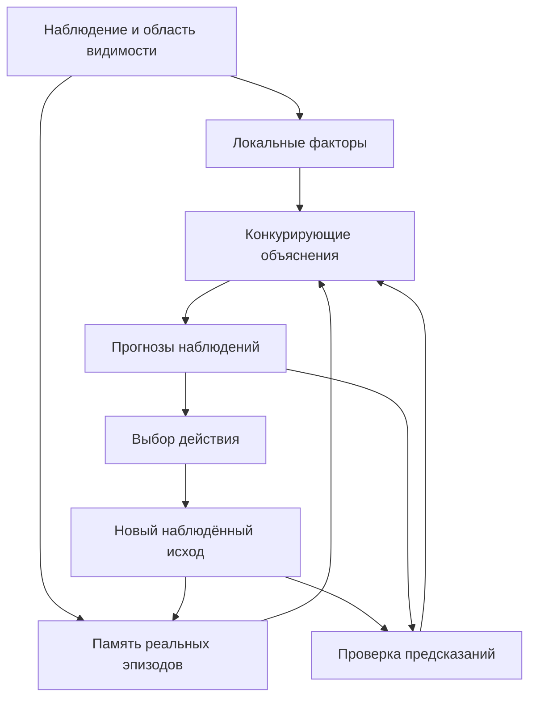

# Следующий слой AI2: объяснения, роли и обучаемые преобразования

Статус: **проект архитектуры, не реализованная возможность и не результат
эксперимента**. Подготовлен 13 сентября 2026 года на основе кода v0.3.0a1
в коммите `73275adc384fbae078b4e461e8921c11ea840178`, трёх присланных заметок
и независимого разбора контрактов. Численные результаты прежней версии
остаются в [V03_RESULTS.md](V03_RESULTS.md).

Полный маршрут до языка и диалога теперь изложен в
[AI2_TO_CHAT_ROADMAP.md](AI2_TO_CHAT_ROADMAP.md). Этот документ описывает
ближайшие контракты наблюдения, ролей и объяснений. После повторной сверки
источников уточнены роль общей памяти трактовок и ограниченная роль
прототипа; конкретный язык правил ниже является инженерным предложением AI2.

Ближайшая цель — научиться собирать из факторных свидетельств несколько
объяснений ситуации, переносить связь между ролями на других участников
и выбирать наблюдение, которое различит оставшиеся объяснения.
Для этого сначала определяем содержание памяти и порядок обучения.
Полный ручной пример приведён в [ARCHITECTURE_WALKTHROUGH.md](ARCHITECTURE_WALKTHROUGH.md).

## 1. Архитектурное решение

Факторная память остаётся обучаемым основанием. Её локальные закономерности
нужно связать с участниками, условиями и изменениями, сохранив основания
каждого вывода. Отдельный устойчивый кластер ещё не определяет объект,
понятие или причинное правило.

Ситуация представляется набором частичных объяснений. В каждом объяснении
указаны: какие наблюдаемые элементы относятся к одному участнику, какие роли
он занимает, в каком представлении получены признаки, какое преобразование
предполагается и что должно стать наблюдаемым после действия.



Короткий код нужен для поиска и согласования представлений. Содержание
участников, роли и ссылки на эпизоды доступны отдельно. Совпадение хешей
не является доказательством тождества. Несовпадение кодов при смене
кодирования не является доказательством появления нового понятия.

Контекстные трактовки должны сопоставляться с согласованной общей памятью
опыта. Отдельные параметры их преобразователей при этом сохраняются.
Нынешние независимые банки `ExperienceMemory` — экспериментальные
отображения; они ещё не реализуют этот общий механизм узнавания.

## 2. Что уже есть и какой разрыв закрываем

| В v0.3 реализовано | Чего пока нет | Следующий контракт |
|---|---|---|
| Локальные кластеры и два варианта консолидации | Кластер не привязан к роли участника и не имеет постоянного ID | Свидетельство о факторе с версией памяти, областью признаков и основанием |
| Полные бинарные входы и цели | Ноль не различает отсутствие и неизвестность | Наблюдение с явной полнотой локальной области |
| `ContextKey(source_context, target_context, action)` | Метки заданы извне; преобразование вида и динамика объединены одним ключом | Раздельные представления наблюдения и перехода мира |
| Один прогноз целевого SDR | Нет набора объяснений с разными ролями и остатком неопределённости | Ограниченный набор совместимых объяснений |
| Архив `ObservedTransition` | Нет дополнений к скрытому исходу, происхождения правил и всего состояния банка на диске | Неизменяемые наблюдения и журнал их объединения по переходу |
| Выбор действия по заданной полезности | Нет открытия правил и выбора различающего опыта по их расхождению | Порождение кандидатов из эпизодов и сравнение наблюдаемых последствий |

У v0.3 низкая полнота сложного преобразования SDR и не подтверждено
преимущество совместной консолидации. Новый слой не исправляет это сам
по себе. Если он получает недостаточные факторы, это должно проявиться
как неполный прогноз или отказ, а не быть скрыто другой логикой.

## 3. Минимальные представления

Следующая таблица задаёт контракты, а не существующие классы Python.
На первом шаге достаточно небольших неизменяемых записей и списков.

| Запись | Обязательное содержание | Инвариант |
|---|---|---|
| `Observation` | ID наблюдения, ID перехода, фаза до/после, источник, версия датчика, система отсчёта, измеренные поля, области полноты | Наблюдение не дополняется прогнозом; каждое известное поле имеет источник |
| `EntityBinding` | Связь локальных обозначений датчика с предполагаемым участником | ID участника не равен его классу, цвету или позиции; спорная связь остаётся гипотезой |
| `FactorEvidence` | Версия кодирования и памяти, рецептивная точка, снимок кластера или постоянный ID с ревизией, локальная область, связанные реальные переходы | Один выходной бит может объединять несколько кластеров; сигнатура после подрезки не является постоянным ID |
| `Prototype` | Технический ориентир сравнения: реальный пример, устойчивые части, варианты, исключения и версии | Сам по себе не определяет смысл; усреднять можно только сопоставленные части |
| `ViewTransform` | Исходная/целевая система отсчёта, правило перепредставления, область применимости и потери | Изменение вида не создаёт событие изменения мира; обратимость заявляется только на указанной области |
| `OperatorCandidate` | Тип действия, переменные ролей, условие применимости, предполагаемая разность, неизменившиеся проверенные поля, происхождение | Правило относится к переменным, а не к именам обучающих объектов |
| `Explanation` | Привязки участников и ролей, контекст, кандидаты правил, подтверждённые части, противоречия, неизвестное | Допустимо несколько объяснений; итоговый балл не заменяет их содержание |
| `Prediction` | Версия объяснения, действие, возможный исход и то, что датчик сможет увидеть | Недоопределённый исход остаётся множеством возможностей или `unknown` |
| `EvidenceLedger` | Уникальные переходы, новые наблюдения к ним, поддержка/опровержение по проверенным полям | Новое измерение старого перехода не считается ещё одним выполнением действия |

### Наблюдаемость и роли

Для атомарного утверждения различаются три состояния: подтверждено,
опровергнуто измерением, неизвестно. Для числового или категориального поля
это измеренное значение либо неизвестность. Отсутствие объекта можно
утверждать только при известной полноте обзора соответствующей области.

Порядок строк датчика и имена объектов не являются ролями. Роли задаются
связью: например, `act(initiator=A, recipient=B)`. При перестановке ролей
получается другой запрос. Кодировать только общую совокупность признаков
обоих объектов недостаточно: объединение битов теряет направление связи.
Предлагается кодировать локальные атомы вида `(роль, поле, значение)`
с версией кодовой книги и хранить исходные атомы рядом.

Разметка границ объектов, названия каналов измерения, доступные команды
и цель на первом стенде предоставляются интерфейсом среды. Это явно
заданная структура входа; мы не называем её самостоятельно выученными
понятиями. Обнаружение объектов в пикселях или тексте — отдельный этап.

### Как безопасно соединить это с нынешним ядром

В `CombinatorialMemory._update_existing` неактивный целевой бит считается
отрицательным исходом; в истории входа учитывается каждый ноль. Маска
в одной внешней обёртке не меняет эти правила. При OR-кодировании видимых
и скрытых признаков нельзя в общем случае получить корректную маску SDR
простым объединением масок известных признаков.

Минимальный мост на первый этап:

1. Сохранять все действительные наблюдения, в том числе неполные.
2. Сравнивать объяснения только по измеренным полям; пропуск не штрафовать
   как ошибку и не засчитывать как совпадение.
3. Передавать нынешнему бинарному ядру только **полные локальные пары**.
   Полноту области устанавливает контракт датчика. Вклад неизвестных
   внешних полей в её кодирование запрещён.
4. Фиксировать схему области и кодирование до обучения. Изменение состава
   области требует другой версии или явной миграции.
5. Если полной пары нет, не обучать на ней ядро. Сохранять причину
   `incomplete_scope`, запросить доступное измерение или вернуть `unknown`.

Так мы можем проверять скрытое наблюдение без немедленной переделки всего
алгоритма консолидации. Собственное обучение ядра с масками потребует
отдельного решения: знаменателей поддержки по наблюдаемым битам,
трёхзначной истории, отрицательных примеров и нового формата сохранения.
Оно не объявляется выполненным этим документом.

## 4. Понятие, состояние, вид и действие

Опорный пример и устойчивые части могут помогать хранению и сравнению,
но не исчерпывают содержание понятия. В контекстно-смысловой схеме
существенны правила трактовки и общая память, как уточняется в
[технической части статьи Редозубова 2021 года](https://habr.com/ru/articles/551644/).
Новые примеры сначала согласуются по участникам и системе отсчёта;
лишь затем обновляется общее представление. При неоднозначном
согласовании поддерживаются несколько вариантов.

Нужно различать четыре вопроса:

| Новое наблюдение | Возможное объяснение | Что требуется проверить |
|---|---|---|
| Другая координата того же участника | Новое состояние | Непрерывность наблюдения и связь с действием |
| Другие экранные координаты при том же расположении мира | Другое представление | Известное или подтверждённое согласование систем отсчёта |
| Повторяющаяся разность после действия | Новый оператор либо новое условие старого | Несколько различающихся реальных переходов, отрицательные случаи, перенос ролей |
| Устойчивая особенность, не объяснённая уже допустимыми изменениями | Новый класс/вариант прототипа | Остаточная новизна после согласования, повторяемость, цена разделения |

Это кандидаты объяснений, не универсальный классификатор новизны.
По одному несогласованному кадру их часто нельзя различить. Метка
`unresolved_novelty` лучше преждевременного создания нового класса.

Если одновременная смена вида и действие дают одинаковые видимые результаты
при нескольких моделях, истинный механизм не идентифицируется из этих данных.
Нужны дополнительные наблюдения, контролируемый опыт или явно принятое
ограничение среды. Успешное предсказание в одном режиме само по себе
не доказывает причинность.

## 5. От эпизодов к правилам

Правила появляются в два шага: локальное факторное свидетельство выделяет
повторяющееся условие/изменение; ограниченный конструктор связывает его
с ролями и проверяет перенос. Конструктор задаёт язык возможных правил,
а конкретные правила и их применимость должны зависеть от опыта.

### Ограниченный язык первого шага

| Элемент | Разрешённая форма |
|---|---|
| Участники | Две разные переменные ролей `r0`, `r1` |
| Значения | Наблюдаемые каналы и их значения; при переносе привязка к роли |
| Условие | Известный атом, сравнение значений, небольшая конъюнкция с факторным основанием |
| Эффект | Сохранение поля; присваивание наблюдавшейся константы; копирование поля до действия из роли в роль |
| Дополнения после первого шага | Смещение, перестановка участников, композиция уже подтверждённых операторов |

В первом вертикальном срезе — одна изменяемая величина и эффект глубины 1.
Нельзя сразу включать произвольные программы и неограниченное ветвление.
Предпочтение более короткой записи — инженерное ограничение поиска,
а не доказательство истинности самой короткой гипотезы.

### Порядок рождения и отбора

1. **Записать переход.** Зафиксировать наблюдаемое «до», выбранное действие,
   наблюдаемое «после» и полноту локальных областей. Не читать скрытое
   состояние оценщика и не получать метку правильного правила.
2. **Согласовать.** Построить ограниченные привязки ролей и представления.
   При нескольких допустимых привязках не обучать ядро на одной как на
   установленной истине: отложить пару или хранить разделённые условные
   варианты, пока не получено основание выбрать привязку.
3. **Извлечь разность.** На общих известных полях сохранить изменения
   и проверенные неизменности. Непросмотренное поле не получает эффект
   «сохранить». Из совпадения до/после нельзя вывести, что поле вообще
   никогда не меняется.
4. **Обучить локальные связи.** Полные области до/после или до/разность
   кодируются фиксированным образом и поступают в факторную память.
   Целевые данные — измеренные изменения; ID истинного оператора не нужен.
5. **Предложить кандидаты.** По совпадающим локальным основаниям и эпизодам
   заменить имена участников переменными, сопоставить возможные источники
   изменившегося значения и построить короткие выражения из языка.
   Если два источника всегда совпадали, сохранить обе версии.
6. **Проверить противоречия.** Применить кандидатов к доступным исходным
   состояниям. Использовать и случаи, где предполагаемое условие не
   приводит к эффекту. Подтверждение относится только к проверенным полям.
7. **Оставить различимые альтернативы.** Эквивалентные на увиденных данных
   правила не обязаны быть эквивалентны вообще. По возможности сохранять
   представителей с разными прогнозами доступного следующего опыта.
8. **Запросить различающий опыт.** Проверить заранее записанные прогнозы
   по новому действительному исходу. Использовать новые данные для
   пересмотра, а не переписывать старый прогноз задним числом.

Новые кандидаты имеют статус `proposed`, затем `supported`, `contradicted`
или `retired`. `supported` означает наличие указанной поддержки в заданной
области, а не универсальный закон. Порог продвижения задаётся протоколом
до проверки. Уникальные ID переходов предотвращают повторный учёт,
но сами по себе не гарантируют статистической независимости опытов.

### Роль факторного ядра должна быть проверяемой

Каждое применённое обученное правило должно иметь проверяемую связь
с факторными свидетельствами и реальными переходами. Парсер и конструктор
не получают функцию мира, скрытые классы или правильный ответ. Случайный
совпавший выходной бит не считается достаточным основанием.

Допустимо порождать ещё неподтверждённые варианты для исследования, ясно
маркируя их статус. Их условные прогнозы служат выбору опыта и не считаются
ответами обученного `supported`-оператора. Нельзя при отсутствии факторной поддержки тайно
переключаться на готовый решатель и приписывать его ответ памяти.
В таком случае результат — недостаточное покрытие/неизвестность.

Позднее нужны две разные проверки: (а) нарушить или убрать факторные
свидетельства и увидеть корректное воздержание; (б) сравнить качество
и стоимость обучения с одинаковым языком правил и другими способами
получения кандидатов. Первая проверяет соединение модулей; только
сравнительный опыт может показать полезность факторного механизма.

## 6. Конкуренция объяснений и выбор опыта

Для каждого объяснения отдельно хранятся число проверенных утверждений,
совпадения, противоречия, покрытие наблюдения и неизвестные поля. Пустой
прогноз не получает максимальную оценку за отсутствие ошибок. Несколько
копий одного объяснения с другими ID не создают дополнительную поддержку.
Совместимость проверяется и внутри объяснения: одна привязка не может
одновременно приписать одному измеренному полю разные значения.

В детерминированном первом стенде измеренное противоречие исключает кандидата
в объявленной области. Для шумного датчика это правило неприменимо:
понадобится модель ошибок и иной критерий пересмотра. Знакомость,
голоса кластеров и число совпадений не называются вероятностями.

Для выбора различающего действия сравниваются **прогнозы доступных
наблюдений**, а не скрытых состояний. Простейшая оценка — число пар
кандидатов, у которых возможные видимые исходы не пересекаются. Если исход
скрыт или его видимость неизвестна, гарантированное различение не заявляется.
При равенстве учитываются заданная цель, стоимость и воспроизводимый
порядок выбора. Это эвристика по текущему набору кандидатов, не вычисленная
информация обо всех возможных моделях мира.

Иногда сначала нужно подготовить ситуацию, а затем проверить действие.
В таком случае оценивается весь короткий план вместе с обоими расходами.
Само подготовительное перемещение может не различать ни одной гипотезы.
На первом шаге допустим заранее описанный шаблон опыта из двух команд;
это явно предоставленная процедура, не открытое моделью планирование.

Нужно всегда сохранять статус `search_complete=false`, если лимит отсёк
кандидатов. Одна оставшаяся гипотеза после отсечения не означает, что
других объяснений не существует. Для неполного набора полезно хранить
отдельную отметку «механизм вне языка/не найден», не притворяясь, что
ей присвоена калиброванная вероятность.

## 7. Жизненный цикл эпизода и памяти

Наблюдения неизменяемы. Если исход был закрыт, его раскрытие добавляет
новую запись к тому же физическому переходу. До раскрытия объяснение
может иметь прогноз, но этот прогноз не заполняет целевую пару обучения.

Журнал различает:

- `transition_id`: одно действительное выполнение действия;
- `observation_id`: одно измерение, в том числе дополнительный вид;
- область и версию пары, уже переданной конкретной памяти для обучения.

Два измерения одного исхода могут расширить известное содержание,
но не дают двух независимых выполнений действия. Несколько областей
одного перехода могут обучать разные локальные памяти; общая поддержка
правила всё равно считает этот переход один раз.

Существующий `ExperienceMemory` не принимает изменённое содержание того же
`event_id` и отклоняет старые ID. Его нельзя использовать как журнал
постепенного раскрытия. В минимальном последовательном стенде передача
в него происходит один раз после полноты выбранной области, до перехода
к следующему обучаемому событию. Для позднего раскрытия старых событий
понадобится отдельный журнал и явный протокол однократной доставки;
простое переименование старого события новым ID недопустимо.

Кроме того, нынешний банк дедуплицирует `event_id` глобально, даже между
разными `ContextKey`. Поэтому этот консервативный мост допускает только
одну доставку выбранной области на переход и банк. Обучение нескольких
областей одного перехода — требование к новому маршруту доставки,
а не возможность, которую можно получить сменой ID в прежнем API.

Повторная консолидация использует прежние основания и может пересмотреть
кластеры. Она не увеличивает число наблюдений и не порождает новые
подтверждения. Переоценённый старый прогноз сохраняет ссылку на старую
версию; прогноз, сделанный до исхода, остаётся доступным отдельно.

Архив эпизодов ограничен по количеству и байтам. Вытеснение должно сохранять
сведения о том, какая поддержка больше не проверяется по полному исходнику.
Нельзя удалять все контрпримеры и продолжать показывать только удобные
подтверждения. При отсутствии места новый объект памяти отклоняется
явно или применяется заранее определённая политика с журналом причин.

Смена кодирования требует отдельной версии, сопоставления кодов либо
переобучения из сохранившихся наблюдений. Между разными версиями нельзя
сравнивать голые индексы битов. Сохранение всего нового слоя должно
включать кодовые книги, журнал доставки, версии правил и генератор
случайности; нынешний NPZ одной памяти этого не обеспечивает.

## 8. Ограничение вычислений и видимый прогресс

Для первого прототипа предлагается небольшой фиксированный бюджет.
Это стартовые инженерные значения для проверки поведения, не следствие
метафор из заметок и не доказательство достаточности памяти.

| Ресурс | Начальная граница | Что происходит при исчерпании |
|---|---|---|
| Участники одного опыта | 2 | Более крупный вход отклоняется явно |
| Привязки двух разных ролей | 2 перестановки | Учитывается ограниченная область задачи |
| Варианты представления | 2 | Непредусмотренный вид получает `unknown_view` |
| Кандидаты правил на поступление | 128 | Сохраняется неполнота поиска и число рассмотренных |
| Объяснения в активном наборе | 8 | Отсечение записывается; сохраняется разнообразие прогнозов |
| Реальные переходы в полном архиве | 32 плюс предел байтов | Политика вытеснения или отказ видимы в журнале |
| Горизонт различающего шаблона | 2 команды | Более длинный план не ищется автоматически |
| Глубина выражения эффекта | 1 | Композиция отложена |

Алгоритм не перебирает декартово произведение всех объектов, контекстов
и правил без остановки. Сначала получает ограниченные факторные кандидаты,
затем проверяет совместимые привязки. Лимит числа кандидатов ограничивает
качество поиска; это нужно показывать вместе с результатом.

Будущий стенд должен выдавать запись прогресса после каждого реального
перехода и во время долгого шага: фаза, затраченное время, просмотренные
кандидаты, сколько осталось в наборе, причина ожидания, путь контрольной
записи. Проверка внутреннего бюджета времени выполняется между единицами
работы; внешний процесс ограничивает один зависший вызов. Контрольная
запись атомарна и содержит причину неполного завершения.

Это требования к будущему запуску, а не обещание, что процесс никогда
не зависнет. Оценка времени возможна по завершённым однотипным единицам;
при неизвестном числе новых гипотез нужно сообщать бюджет, а не выдуманный
процент готовности.

## 9. Порядок следующей реализации

Сейчас завершено проектирование контрактов и ручного примера. Программные
этапы ниже ещё не выполнены.

| Шаг | Узкий результат | Критерий готовности |
|---|---|---|
| 1. Граница наблюдения | Неизменяемые записи, полнота областей, роли, журнал переходов | Скрытый исход остаётся неизвестным; раскрытие учит один раз; перестановка строк не меняет роли |
| 2. Факторное основание объяснения | Адаптер полных локальных пар и проверяемые ссылки на кластеры/эпизоды | Нет обходного готового ответа при отсутствии факторной поддержки; версии и причины отказа видимы |
| 3. Кандидаты из опыта | Короткие правила из фиксированного языка, поддержка и противоречия | Правила не передаются через `rule_id`; одинаковый язык работает при другой функции мира |
| 4. Различающий опыт | Несколько объяснений, записанные прогнозы, короткий шаблон действия | Выбранный опыт имеет разные доступные исходы; неполный поиск не маскируется уверенностью |
| 5. Новый перенос | Другие участники, новые сочетания знакомых значений, иной вид | Проверка на данных, не использованных при выборе архитектуры; отдельно ошибки факторов, привязки, правил и планирования |

Первый исполняемый срез должен пройти один небольшой мир целиком.
Отдельные большие механизмы — автоматическое выделение объектов,
открытие произвольных контекстов, обучение с масками внутри ядра,
композиция операторов, полноценное планирование и язык — добавляются
после установления того, что уже работает на этом срезе.

Сам ручной пример не доказывает обучение: любой способ решения может
воспроизвести заранее известную трассу. В следующем эксперименте нужны
варианты функций мира в одном языке, новые назначения ролей и значений,
контроль без факторного извлечения, а также случаи, где правильный исход
остаётся неизвестным. Точность, полнота, число разных переходов, время
и реальная память измеряются раздельно.

Временная ориентация для следующей работы: контракты → один исполняемый
пример → новое небольшое сравнение. Оценивать часы реализации и проверки
имеет смысл отдельно для выбранного шага; время до СИИ или превосходства
над GPT из этого плана не выводится.

## 10. Опора на присланные материалы

Ниже фиксируется происхождение архитектурных мотивов. Строки относятся
к исходным загруженным UTF-8-файлам; исходные тексты в репозиторий не
копируются. Авторство всех трёх файлов не установлено этим анализом.
Метафорические и нейроанатомические соответствия не рассматриваются
как доказанный механизм мозга.

| Мотив в заметках | Файл и строки | Наше инженерное уточнение |
|---|---|---|
| Внутренний и межконтекстный код | `пал(1).txt`, 94–96; 235 | Отделить содержание от индекса, явно проверять эквивалентность и коллизии |
| Один вход допускает локальные трактовки | `гиль(1).txt`, 602; `пал(1).txt`, 358 | Ограниченный набор объяснений с явными противоречиями |
| Согласование центра и периферии | `гиль(1).txt`, 487–488, 604; `Новый текстовый документ(1).txt`, 4219 | Версионированный прототип и выравнивание перед обновлением |
| Действие связывает до и после | `пал(1).txt`, 455–459 | Оператор с ролями, условиями и наблюдаемым эффектом |
| Прямой и обратный ход | `пал(1).txt`, 472–478 | Различать прогноз и поиск возможных предшественников; обратимость не предполагается |
| Гипотеза рождается из примера | `пал(1).txt`, 149 | Кандидат с происхождением; один пример не делает его подтверждённым законом |
| Новизна относительно центра класса | `Новый текстовый документ(1).txt`, 1179–1181 | Проверять состояние, представление и оператор до решения о новом классе |
| Эпизоды, гипотезы и сон | `Новый текстовый документ(1).txt`, 388 | Отдельные журналы наблюдений и поддержки; replay не увеличивает число опытов |

Заметки не определяют готовую грамматику, алгоритм привязки ролей,
маски наблюдаемости, критерий выбора действия или бюджет поиска.
Эти решения выше — проект AI2, вдохновлённый материалами, а не дословная
реализация законченной авторской спецификации.

Для сверки версий исходных файлов:

```text
пал(1).txt
ba57d3991fd62ba5f8efe81deb55b4a01e80de423a024d5599d2a6a8c49c1705
Новый текстовый документ(1).txt
4e6b091698dfdac347312e66e7e12fa56fb08c879c59c5c8c667b93701f78bc7
гиль(1).txt
27e316c53b617702d9bb85a0ba935cc9eba93886c643aa5d8440b2c1bd8e358e
```

В [части 12 «Логики сознания»](https://habr.com/ru/articles/326334/)
Алексей Редозубов описывает локальные кластеры-гипотезы, их отбор по
последующему опыту и один вариант консолидации. Автор прямо допускает
другие варианты алгоритма. Это основание продолжать исследование
факторного ядра, а не считать конкретное уравнение неизменяемым.
Статья [Morzhakov и Redozubov, 2017](https://arxiv.org/abs/1712.05954)
предлагает архитектуру преобразований контекстов. Ни один из этих
источников сам по себе не подтверждает работоспособность нового слоя
AI2; её ещё предстоит проверить.
