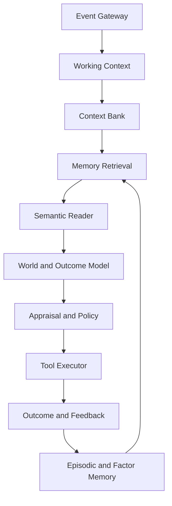

# Дорожная карта AI2

Версия: 1.0, 13 сентября 2026 года.

## Цель

За 12 месяцев построить исследовательского практического агента, который
накапливает проверяемый опыт, рассматривает несколько трактовок наблюдения,
извлекает релевантные эпизоды, безопасно действует через инструменты и
демонстрирует измеримое улучшение на реальных задачах пользователя.

Цель не формулируется как «сильный ИИ». До появления интегральных результатов
корректное название — исследовательский практический агент AI2.

## Архитектурный принцип

Языковая модель отвечает за язык и общее рассуждение. AI2 отвечает за
контролируемую долговременную память, контекстную интерпретацию, накопление
опыта, оценку исходов и измеряемое улучшение поведения.



## Целевые слои

| Слой | Ответственность | Минимальная реализация | Контроль |
|---|---|---|---|
| Event Gateway | Нормализовать сообщения, файлы, результаты инструментов и обратную связь | `Pydantic Event`, время, provenance | Схема, дедупликация, политика PII |
| Working Context | Цель, ограничения, текущая ветка и короткая история | Ограниченное окно и state machine | Token и latency budget |
| Episodic Memory | Хранить конкретные события, попытки и исходы | SQLite/Postgres и hybrid index | Источник каждого факта, update и forget |
| Factor Memory | Выделять повторяющиеся локальные сочетания | Нынешнее sparse-ядро AI2 | Support, counterexamples и task lift |
| Context Bank | Параллельно преобразовывать наблюдение | Rule, prompt и sparse transform adapters | Held-out gain и overlap penalty |
| Semantic Reader | Собрать доказательства и дать трактовки | LLM и цитируемые memory items | Abstention и evidence coverage |
| World/Outcome Model | Предсказывать последствия действий | Кандидаты действий и LLM simulator | Калибровка и counterfactual tests |
| Appraisal/Policy | Оценить полезность, риск и правила | Вектор value/risk плюс hard policy | Жёсткие ограничения отдельно от reward |
| Tool Executor | Исполнить выбранное действие | Typed tools, dry-run и approval gates | Least privilege, idempotency и audit |
| Consolidator | Обобщать, сжимать, забывать и откатывать | Плановый job и immutable snapshots | Retention test и rollback |
| Evaluator | Измерять качество и причинный вклад | Offline harness, traces и ablations | Frozen suites, seeds и bootstrap CI |

## Основные структуры данных

```text
Event(id, occurred_at, actor, channel, payload, provenance, embedding, sdr)
Episode(id, event_ids, goal, outcome, reward, contexts, summary, evidence)
ContextTransform(id, version, input_schema, transform, detector, confidence, domain)
Factor(id, code, support, examples, counterexamples, contexts, task_lift, last_seen)
ActionTrace(id, state, candidates, evidence, decision, tool_calls, result, feedback)
```

Каждый утверждаемый системой факт обязан иметь ссылку на событие или внешний
источник. Обновление не перезаписывает историю: создаётся новая временная версия.

## Предлагаемая структура Python-проекта

```text
src/ai2/core/                  # существующее разреженное ядро
src/ai2/agent/runtime.py       # наблюдение -> решение -> действие
src/ai2/memory/episodic.py     # события и эпизоды
src/ai2/memory/retrieval.py    # BM25, dense, sparse и hybrid
src/ai2/context/transforms.py  # реестр и версии контекстов
src/ai2/planning/world.py      # кандидаты и прогноз исходов
src/ai2/policy/appraisal.py    # value, risk и constraints
src/ai2/tools/                 # типизированные безопасные инструменты
evals/suites/                  # frozen задачи и manifests
docs/HYPOTHESES.md             # H1-H8, протокол и решения
```

## Базовые системы

Новый механизм оценивается только как добавка к предыдущему уровню.

| ID | Система | Что изолирует |
|---|---|---|
| E0 | LLM без долговременной памяти | Нижняя граница и способность языкового ядра |
| E1 | LLM плюс сырой журнал последних событий | Эффект простого long context |
| E2 | LLM плюс BM25 | Дешёвый лексический retrieval |
| E3 | LLM плюс dense RAG | Современная семантическая базовая линия |
| E4 | LLM плюс AI2 sparse-factor memory | Чистый вклад разреженных факторов |
| E5 | E4 плюс Context Bank | Вклад параллельных трактовок |
| E6 | E5 плюс Appraisal/World Model | Вклад оценки и моделирования исходов |
| E7 | Полная система плюс consolidation | Долгий горизонт, стоимость и забывание |

Для E2-E4 фиксируются одинаковые token, storage и latency budgets. Нельзя
вручную выбирать удачные примеры или давать одному варианту больше контекста.

## Наборы задач

| Набор | Проверяет | Когда использовать |
|---|---|---|
| Synthetic Factors | Известная скрытая структура, шум, дрейф и контрпримеры | Калибровка discovery и planted-answer |
| AI2 Ambiguity Suite | Один вход с несколькими допустимыми контекстами | Проверка Context Bank и abstention |
| LoCoMo | Долгосрочная диалоговая память и временные связи | После E3-E4 |
| LongMemEval | Извлечение, межсессионное рассуждение, обновления и отказ | Основной внешний memory benchmark |
| LongMemEval-V2 | Опыт в среде, workflow, gotchas и premise awareness | После появления runtime |
| GAIA | Реальные вопросы, web/tool use, мультимодальность и рассуждение | Поздняя общая проверка |
| tau-bench | Диалог, API, правила, конечное состояние и `pass^k` | Надёжность действий |
| Private Vertical Suite | 20-50 реальных задач пользователя с машинным критерием | Главный продуктовый go/no-go |

## Метрики

- Память: `evidence recall@k`, temporal/update accuracy, contradiction rate,
  abstention precision, provenance coverage.
- Поведение: exact end-state success, `pass^1`, `pass^4`, `pass^8`, число
  исправлений, regret и policy violations.
- Обобщение: held-out contexts, novel compositions, domain shift, устойчивость
  к отвлекающим элементам и переставленной истории.
- Пластичность: time-to-learn, retention после N обновлений,
  backward/forward transfer и rollback fidelity.
- Экономика: p50/p95 latency, число LLM и tool calls, retrieved tokens,
  RAM/disk на эпизод и стоимость успешной задачи.
- Статистика: paired bootstrap 95% CI, заранее выбранная primary metric,
  минимум три seed/rollout для стохастических частей.

## Ворота go/no-go

Значения ниже являются первичными инженерными порогами. После пилота их нужно
уточнить до просмотра итогового результата.

| Ворота | Минимум для продолжения | Если не выполнено |
|---|---|---|
| Memory lift | `+5` процентных пунктов end-to-end accuracy или `-25%` стоимости при не меньшем качестве против лучшего baseline | Оставить AI2 memory исследовательским backend |
| Context lift | `+7` пунктов на ambiguity suite и положительный перенос на private suite | Не включать multi-context в production path |
| Causal gate | On-target intervention сильнее matched control, 95% CI не пересекает ноль | Считать структуру корреляционной |
| Reliability | `pass^4` не хуже 90% от `pass^1`, критических policy violations нет | Ограничить автономность и инструменты |
| Retention | После консолидации сохраняется не менее 98% критических фактов и 95% task success | Отключить или перепроектировать consolidation |
| Latency | p95 отвечает продуктовой цели и дополнительный слой улучшает Pareto-front | Упростить router или выполнять асинхронно |

## План на 12 месяцев

| Период | Цель | Результаты | Ворота |
|---|---|---|---|
| Недели 1-2 | Зафиксировать науку и продукт | Тег AI2 v0.1, H1-H8, event schema, private suite v0, baseline manifest | Воспроизводимый E0 |
| Недели 3-6 | Построить eval harness и память | E0-E4, episodic store, BM25 и dense retrieval, единые traces | Memory lift или ясный отрицательный результат |
| Недели 7-12 | Вертикальный агент | Runtime, 2-3 безопасных инструмента, evidence reader, approvals и dashboard | Надёжно решает ограниченный сценарий |
| Месяцы 4-5 | Context Bank | Rule, prompt и sparse transforms, novelty/overlap, ambiguity suite | Context lift против prompt ensemble |
| Месяцы 6-7 | Оценка и планирование | Appraisal vector, hard policy, candidate actions, outcome calibration | Лучше E5 при равном бюджете |
| Месяцы 8-9 | Консолидация | Summaries, factor promotion, decay, snapshots и rollback | Retention и cost gate |
| Месяцы 10-12 | Интеграция и внешний аудит | LongMemEval, GAIA и tau-bench subset, security/privacy review, публичный tech report | Решение go/no-go на beta |

## Первые 30 дней

### Неделя 1

- выбрать один вертикальный сценарий и 20-50 реальных задач;
- утвердить машинно проверяемый критерий конечного результата;
- зафиксировать AI2 v0.1 и H1-H8;
- описать `Event`, `Episode` и `ActionTrace`;
- создать baseline manifest.

Definition of done: все обязательные поля и primary metrics согласованы, каждая
задача имеет ожидаемое конечное состояние.

### Неделя 2

- добавить eval runner и JSONL traces;
- сохранять commit hash, seed и версии зависимостей;
- реализовать E0-E2;
- создать не менее 50 synthetic factor cases, включая шум, дрейф и
  контрпримеры;
- добавить planted-answer calibration.

Definition of done: один CLI-вызов воспроизводит итоговую таблицу результатов.

### Неделя 3

- добавить dense RAG;
- сделать адаптер нынешней AI2 factor memory;
- уравнять token и storage budgets;
- добавить paired bootstrap CI и sealed test split;
- запустить E2-E4 без ручного выбора примеров.

Definition of done: есть честный memory verdict с интервалами неопределённости.

### Неделя 4

- реализовать agent runtime;
- подключить один read-only инструмент;
- подключить один обратимый write-инструмент с dry-run;
- прогнать 20 private tasks;
- зафиксировать evidence, решение, действие, результат и feedback в trace.

Definition of done: критические операции требуют gate, а успешность определяется
конечным состоянием, не качеством текста ответа.

## Рекомендуемый первый вертикальный сценарий

Если владелец проекта не выберет иной вариант, рекомендуется
`research-assistant`: агент получает ограниченный корпус документов, отвечает с
источниками, помнит исправления между сессиями, различает конфликтующие версии и
умеет создать обратимый исследовательский артефакт.

Почему этот сценарий подходит:

- проверяет память, контекст, provenance и обновления;
- допускает машинную и экспертную оценку;
- write-действия можно сделать обратимыми;
- не требует обучения собственной фундаментальной модели;
- имеет прямые baseline: без памяти, BM25 и dense RAG.

## Риски

| Риск | Ранний индикатор | Мера |
|---|---|---|
| Внутренняя структура принята за смысл | Красивые карты без task lift | Behavioral gate, matched controls и counterexamples |
| Переусложнение раньше продукта | Много модулей, нет end-to-end задачи | Один вертикальный сценарий, E0-E7 по слоям |
| Benchmark leakage | Растёт dev, held-out отсутствует | Frozen private test, preregistration и sealed runs |
| Ложная память и конфликт обновлений | Несогласованные факты без источника | Provenance, temporal versions, abstention и rollback |
| Неограниченный рост памяти | Латентность и диск растут линейно | Budgets, tiering и consolidation только после retention gate |
| Опасные tool actions | Агент действует при низкой уверенности | Least privilege, dry-run, approvals и idempotency |
| PII и секреты в эпизодах | Сырые токены и файлы в traces | Classification, encryption, deletion и access logs |
| Неясная лицензия исходника | План публичного копирования VB-кода | Независимая реализация и юридическая проверка |
| AGI-маркетинг опережает данные | Общие заявления по узким тестам | Публиковать scope, confidence и отрицательные результаты |

## Правила автономности

- Начинать с read-only режима.
- Запись разрешать только для обратимых действий с явным журналом.
- Сохранять решение, доказательства, версию контекста и инструмент до действия.
- Низкая уверенность, конфликт памяти или отсутствие источника переводят систему
  в abstain/ask mode.
- Hard policy не смешивается с обучаемой value-оценкой.
- Консолидация не удаляет исходные события до прохождения retention test и
  окончания срока восстановления.
- Каждая новая автономная возможность получает отдельный benchmark, threat
  model и kill switch.

## Следующее решение владельца проекта

До начала разработки AI2 v0.2 нужно утвердить:

1. один вертикальный сценарий;
2. 20-50 реальных задач и критерии конечного результата;
3. primary metric;
4. допустимые read-only и reversible write-инструменты;
5. ограничения на данные, стоимость и задержку.

До этого решения новые теоретические модули не добавляются.
